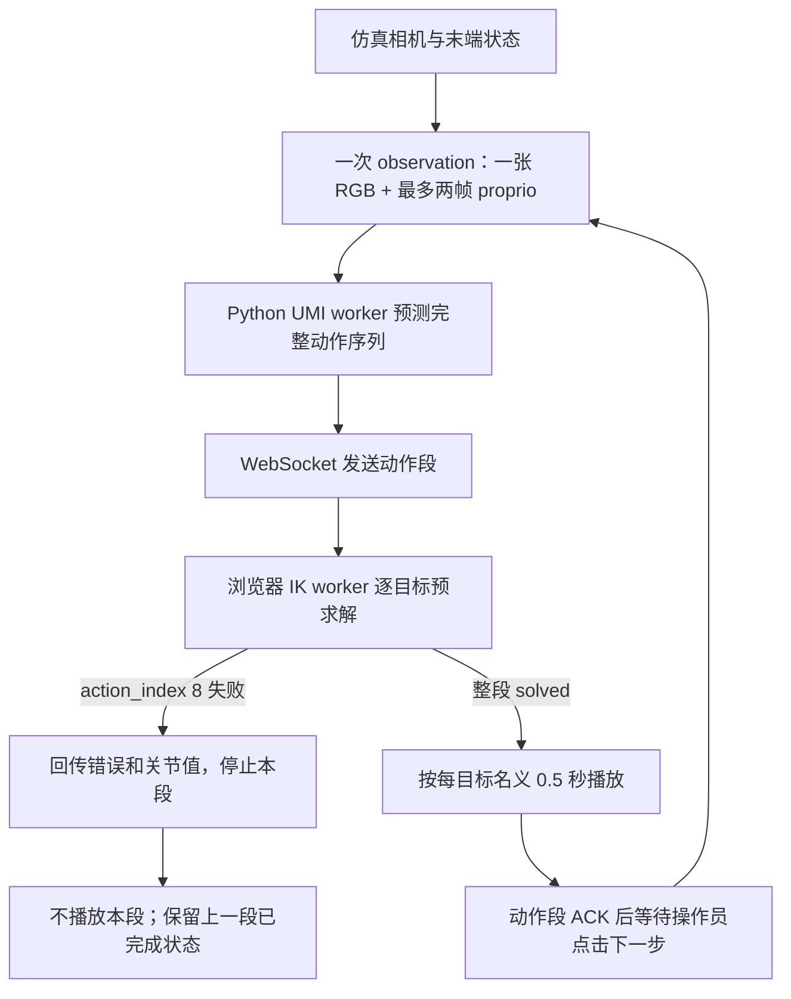

# Executive Summary

审计日期：2026-10-03。范围为 UMI 策略输出、robot-sim 的坐标转换、IK 预求解、播放时序、视觉输入、TCP 定义与当前数据日志。审计只读；本报告是本轮唯一新增文件。

1. **失败发生在哪里：** frame_index 1 的 action_index 8 在浏览器 IK 预求解中因 no_joint_motion 退出；本动作段尚未开始播放。
2. **最强证据指向什么：** 用户记录的位置残差 6.0155 mm 超过 5 mm 容差；姿态残差 0.0017429 rad 在 0.01 rad 容差内。它确认了失败条件，不能证明目标不可达。
3. **哪些问题已排除：** 当前日志为 relative，UMI 与浏览器该表示的变换一致；姿态超限、失败段部分执行和播放时序直接致错均已排除。
4. **哪些问题仍未知：** action_index 8 的 seed、逐轮残差/夹限、受限关节下的可达性，以及检查点训练视觉配置和跨系统 TCP 标定。
5. **下一步最值得做什么：** 保存原始 target、startPose、seed 后，对同一目标运行合法多 seed IK，并记录每轮残差和关节变化；这最直接区分当前 seed 停滞与目标不可达。

# System Control Loop



robot-sim 每次 observation 将最新 RGB 与末端位置、旋转历史交给 Python worker；最多取最近两条 proprio 记录，只有一条时复制该记录。接口未包含杯子的世界位姿或图像时间戳（robot-sim/src/app/App.tsx:141-159；robot-sim/src/app/inferenceProtocol.ts:62-68）。当前仿真预测日志中的一段有 16 个动作，但动作数来自模型输出；YAML 中的 16 是配置默认值，不是前端截断值（robot-sim/server/logs/inference-predictions.jsonl:42；universal_manipulation_interface/task/umi.yaml:6-11；universal_manipulation_interface/scripts/umi_sim_replay_worker.py:146-159）。

浏览器收到动作后启动 IK worker。worker 对整段动作逐项求解，任一项失败就立即返回错误；只有全部目标成功才返回 solved，调用方之后才设置播放目标（robot-sim/src/workers/umiIk.worker.ts:56-60,92-119,141-144；robot-sim/src/app/useInferenceReplay.ts:231-275）。因此 action_index 8 失败时，该帧中 action_index 0 至 7 仅有内存中的 IK 解，没有进入物理播放。

成功播放完成并 ACK 后，界面回到等待状态，操作员点击“推理一步”才会请求下一 observation；相机可以继续渲染，但策略不会在动作段中途自动重推理（robot-sim/src/app/useInferenceReplay.ts:510-529,547-570）。这属于手动分段闭环，不是自动连续重规划。

# Confirmed Facts

- 当前预测日志记录 frame_index 1、action_pose_repr relative，预测长度 16；日志中 action_index 8 的相对平移为 [-0.0011583543, 0.0017238006, -0.0232709367] m（robot-sim/server/logs/inference-predictions.jsonl:42）。预测日志摘要记录该目标相对位移约 23.36 mm；这不是 IK 最终残差。
- 用户提供的故障记录称 frame_index 1、action_index 8 的位置残差为 0.0060155 m、姿态残差为 0.0017429 rad，失败原因为 no_joint_motion，blocked joints 为 joint2/joint3（/home/pan/.codex/attachments/6d3ab564-a0e3-4f6a-8593-1d473ba192fd/已粘贴的文本.txt:30-38）。当前仓库没有保存该次完整浏览器错误对象。
- worker 固定使用 maxIterations=100、damping=0.05、positionTolerance=0.005 m、orientationTolerance=0.01 rad、maxAngularStep=0.15 rad、maxLinearStep=0.01 m（robot-sim/src/workers/umiIk.worker.ts:13-20）。
- URDF 中 joint2 和 joint3 的范围均为 [0, 3.14] rad，其余四轴有正负范围（reBotArmController_ROS2/src/rebotarm_bringup/description/RS/urdf/ReBot_Arm_RS.urdf:99-115,193-210,307-324,382-398,466-482,520-536）。
- 当前保留的 action 日志最后一行是 step 132，六轴角度约为 [0.01019, 0, 0, 0.02177, 0.02369, -0.01755] rad（robot-sim/server/logs/inference-actions.csv:31）。它与失败停止动作的日志顺序高度吻合，但 CSV 没有 frame/action 索引；将其认作失败返回角度只能列为 LIKELY。
- 当前 UMI worker 将 policy 的 action_pred 解码为位姿后连同 action_pose_repr 发出（universal_manipulation_interface/scripts/umi_sim_replay_worker.py:41-50,146-159）。本次预测日志的 representation 是 relative。
- 预测日志只保留动作值及位移摘要，不保存起始位姿、IK seed、最终残差或求解历史（robot-sim/server/prediction_log.py:10-18）。CSV 只保留最近 30 条关节记录，且没有帧号或动作号（robot-sim/server/logs/README.md:3-5）。

# Confirmed Bugs

**本次失败的已确认根因：无。** 已确认的直接失败机制是 action_index 8 的位置残差超过容差后，solver 因 no_joint_motion 停止；导致它停在该状态的原因仍未知。

**已确认的表示协议缺陷，不是本次失败根因。** Python worker 发出的 action_pose_repr 未进入服务端转发结构，浏览器协议也没有该字段，前端直接按 relative 组合（robot-sim/server/inference_protocol.py:57-64；robot-sim/src/app/inferenceProtocol.ts:3-9；robot-sim/src/app/useInferenceReplay.ts:309-317）。官方同时实现 relative 和 legacy rel；若上游发送 rel，浏览器按 relative 解码会与官方语义不一致。当前运行日志是 relative，因此该缺陷没有解释本次失败。

# Suspected Issues

- **IK 对初值敏感或陷入局部停滞：POSSIBLE。** action_index 8 最终没有足够的关节变化，但实际 seed 缺失。目标在某个 seed 下是否可解尚未验证。
- **关节边界限制了某条下降方向：POSSIBLE。** step 132 的 joint2/joint3 为 0，恰在下限；但它是失败最终角度的关联推断，且边界检测只记录“位于限位且提议方向朝外”的情况。没有每轮提议方向记录，不能认定下限导致停滞。
- **solver 接受残差变差的更新：POSSIBLE。** 更新后会重新计算残差，但实现没有比较更新前后残差、回滚或缩小步长；当前没有逐轮残差证明故障中曾发生残差恶化（robot-sim/src/core/Kinematics.ts:154-223）。
- **视觉分布差异影响策略输出：POSSIBLE。** 仿真相机是 60° 透视投影且朝杯子真值位置自动瞄准，UMI 标定文件声明 FISHEYE，真实输入还可能经过矫正、裁剪或镜像处理。检查点实际使用的训练预处理没有确认，不能归因到本次 IK 停滞。
- **TCP 坐标未标定：INCONCLUSIVE。** 仿真观测和 IK 都用 gripper_end，真实 UMI 使用实际 TCP；未找到两者间的变换标定。本次求解在仿真内部使用统一 tipLink，因此不能由此证明当前仿真坐标有误。
- **观测状态的时间一致性：POSSIBLE。** Python worker 使用 observation 中的末端状态作为基准，浏览器 IK 请求使用调用时最新的 tcpPose；如果两者跨越状态更新，基准可能不同，但没有本次请求的完整 startPose 记录（universal_manipulation_interface/scripts/umi_sim_replay_worker.py:81-99；robot-sim/src/app/useInferenceReplay.ts:309-317）。

# Ruled Out for This Failure

- **relative 位姿左右乘/旋转次序不匹配：RULED OUT。** 本地 UMI 的 relative 解码为 T_target = T_base × T_rel；浏览器 composePoses 对位置和四元数也实现同一变换。本次日志明确为 relative（universal_manipulation_interface/diffusion_policy/common/pose_repr_util.py:62-64,94-96；robot-sim/src/utils/math.ts:111-114；robot-sim/server/logs/inference-predictions.jsonl:42）。
- **姿态残差超限：RULED OUT。** 提供的 0.0017429 rad 小于 0.01 rad；本次失败超限维度是位置（故障值见用户附件:30-38；阈值见 robot-sim/src/workers/umiIk.worker.ts:13-20）。
- **frame_index 1 前八个动作已物理执行：RULED OUT。** 代码在整段 solved 之前不启动播放；action_index 8 失败让该段提前退出（robot-sim/src/workers/umiIk.worker.ts:56-60,92-119；robot-sim/src/app/useInferenceReplay.ts:253-275）。
- **每目标 0.5 秒的播放时长直接导致此次 IK 失败：RULED OUT。** 失败路径处于 IK 预求解阶段，播放时钟还未开始（robot-sim/src/app/useInferenceReplay.ts:253-275；robot-sim/src/viz/SceneManager.tsx:35-36,57-90）。

# Unknowns

- action_index 8 的完整 world target、求解时真实 startPose、输入 seed，以及 action_index 7 求解后的 seed 值。
- 逐轮 position/orientation residual、关节提议步长、每轴触发夹限的轮次；最终返回的 q 与是否存在任一 seed 可达。
- 故障时完整 worker 错误对象。worker 代码会包含 start_pose、target_pose、seed_joint_values、joint_values、残差、选项和 reason，但当前日志路径只持久化停止时选出的关节值（robot-sim/src/workers/umiIk.worker.ts:92-117；robot-sim/src/app/useInferenceReplay.ts:115-137；robot-sim/server/inference.py:108-121）。
- 当前检查点实际 cfg、训练数据来源、相机历史长度、图像预处理参数及训练采样频率。仓库中的任务 YAML 和示例数据不能替代检查点自身配置。
- 仿真 gripper_end 到训练/真实 UMI TCP 的完整坐标变换。
- 当前检查点训练时是否见过仿真杯子的精确位姿。现有数据没有杯子世界位姿，且无法确认检查点是否由此数据集训练。

# UMI Relative Pose Semantics

官方 UMI helper 区分 relative 与旧版 rel，两者不能混称。当前运行日志是 relative（robot-sim/server/logs/inference-predictions.jsonl:42）。

调用链是：checkpoint 经 load_policy 加载 cfg 和 policy；policy.predict_action 返回 action_pred；diffusion policy 先对 action_pred 做反归一化；仿真 worker 读取 cfg.task.pose_repr.action_pose_repr，把前 9 维转成位姿矩阵再转为平移/旋转向量，并把该表示标签与动作一起发送（universal_manipulation_interface/scripts/umi_sim_replay_worker.py:41-50,96-99,146-159；universal_manipulation_interface/diffusion_policy/policy/diffusion_unet_image_policy.py:175-187）。本次运行记录 representation 为 relative。浏览器收到动作后将旋转向量转换为四元数，以 request.startPose 和动作构造 targetPose，再交给 solveIK（robot-sim/src/workers/umiIk.worker.ts:77-91）。

对 **relative**，编码是 T_rel = inverse(T_base) × T_pose，解码是 T_target = T_base × T_rel（本地镜像 universal_manipulation_interface/diffusion_policy/common/pose_repr_util.py:62-64,94-96；上游固定提交 [pose_repr_util.py](https://github.com/real-stanford/universal_manipulation_interface/blob/d095ba9590df789df5189eea5ee7e431689038a6/diffusion_policy/common/pose_repr_util.py#L62-L96)）。因此：

- p_target = p_start + R_start × p_relative
- R_target = R_start × R_relative

对 **rel**，官方 helper 明确标为 legacy buggy implementation。编码为 p_rel = p_pose - p_base、R_rel = R_pose × inverse(R_base)；解码为 p_target = p_base + p_rel、R_target = R_rel × R_base（同文件:53-61,85-93）。所以 rel 的平移没有按 R_base 旋转，旋转增量在左侧相乘；它与 relative 及当前浏览器 composer 的公式不同。

robot-sim 的 composePoses 对位置使用起始旋转变换相对平移后再加起点，对姿态使用 base quaternion 乘 child quaternion，和上述公式等价（robot-sim/src/utils/math.ts:111-114）。IK worker 对每个动作都以同一个 request.startPose 组成目标；每次成功求解后只更新下一目标的关节 seed，不会把上一目标位姿当作新的相对基准（robot-sim/src/workers/umiIk.worker.ts:77-91,122-133）。

**本次公式结论：CONFIRMED MATCH。** 当前实际使用的 relative 与浏览器 composer 匹配。如果动作实际标为 rel，协议丢字段会让浏览器错用 relative；在精确 identity 起始朝向时，两种实现都退化为平移相加及相同的旋转结果。用户描述的朝向是“约为”identity，而本次 startPose 没有持久化，所以无法单凭该描述量化 legacy rel 错译会产生多大偏差；不过本次日志记录为 relative，故没有证据显示该错译发生。旧报告没有确认的检查点 cfg 仍未直接读取。

# IK Solver Audit

`solveIK` 使用阻尼最小二乘：计算目标与当前末端误差，通过 Jacobian 构造 J Jᵀ + λ²I 并求解，再投影回关节更新；发现位于限位且方向朝外的关节后，将该自由度移除并重新求解（robot-sim/src/core/Kinematics.ts:154-200）。之后逐关节限制单步幅度、夹到关节上下限（同文件:203-223）。

本次 worker 配置为最多 100 轮、固定 λ=0.05、位置容差 5 mm、姿态容差 0.01 rad；单步角度最大 0.15 rad、平移项最大 10 mm（robot-sim/src/workers/umiIk.worker.ts:13-20）。位置误差为欧氏距离，姿态误差为旋转向量模长；只有两项分别低于阈值才成功（robot-sim/src/core/Kinematics.ts:326-343）。

伪代码概括实际控制流：

```text
q = seed
repeat up to maxIterations:
  positionError, orientationError = FK_residual(q, target)
  if both residuals are within tolerance: return converged
  J = jacobian(q)
  deltaQ = damped_least_squares(J, error, damping)
  remove outward-at-limit joints and recompute deltaQ
  limit each deltaQ step; clamp q + deltaQ to joint limits
  if every path-joint change is below 1e-10: stop with no_joint_motion
  q = clamped(q + deltaQ)
  # 下一轮重新计算 residual；此处不比较新旧 residual，也不回滚
return not converged
```

因此代码没有执行 error(q_next) < error(q) 的验收条件；只要还有非零更新就接受 q_next，并在下一轮重算误差。若残差变大，代码不回滚、不缩步，也没有 line search 或 adaptive damping；固定 damping 存在，但它不随进展变化。夹限方向会触发 active-set 重新求解，最终仍可能让提议步长变成零；本次缺逐轮 q 和 residual，不能确认它是否如此。

若所有可动路径关节的提议变化量均小于 1e-10，solver 直接以 no_joint_motion 退出；退出前不会再计算一次新的姿态残差（robot-sim/src/core/Kinematics.ts:203-223）。blockedJoints 表示检测到处于边界且提议方向朝外的关节，不等同于“该关节本轮发生过任意夹限”；返回值只含最终残差、轮数和累计 blocked 列表（同文件:226-237）。实现没有逐轮残差历史、残差恶化回滚、线搜索或自适应阻尼。故 no_joint_motion 说明更新停住，不证明目标不可达，也不能单独证明被报告的关节限制就是原因。

# Failed Target Analysis

故障输入报告给出的 action_index 8 位置残差 0.0060155 m，相对 0.005 m 容差超出 1.0155 mm；姿态残差 0.0017429 rad，远低于容差。直接触发失败的是位置未达标且 solver 最终 no_joint_motion，不是姿态阈值（附件:30-38；阈值见 robot-sim/src/workers/umiIk.worker.ts:13-20）。

预测日志中的 action_index 8 相对平移模长约 23.36 mm，是策略目标增量；它与 6.0155 mm IK 末端残差含义不同，不能相互替代（robot-sim/server/logs/inference-predictions.jsonl:42；robot-sim/server/prediction_log.py:10-18）。

日志中的三个量定义不同：target_displacement_mm 是每个预测目标相对当前末端位置的直线距离；cumulative_path_mm 是从当前末端开始，沿预测目标序列逐段累加的路径长度；position_residual 是某个 IK 当前关节解经 FK 得到的末端位置与固定目标间的欧氏距离。orientation_residual 是当前 FK 姿态与目标姿态的旋转向量误差模长（universal_manipulation_interface/scripts/umi_sim_replay_worker.py:101-127；robot-sim/src/core/Kinematics.ts:326-343；robot-sim/server/logs/README.md:7）。

示意：当前 start pose → 每个 policy target 的距离属于 target_displacement；start pose → target 0 → target 1 的折线路径累计值属于 cumulative_path；IK 当前 q 经 FK 得到的末端 → 固定 target 的差值才属于 position/orientation residual。本次 action_index 8 的 target displacement 约 23.36 mm、cumulative path 约 24.41 mm；position residual 则是独立的 6.0155 mm（该残差来自用户故障记录，不来自 prediction JSONL）。

现存 CSV 最后一条 step 132 的 joint2 和 joint3 为 0，正好位于 URDF 下限。根据成功段动作记录、随后失败停止回传关节值的控制路径，这行很可能是失败时返回的关节状态；由于 CSV 没有 frame/action 标记，结论为 LIKELY，且它不能代替 action_index 8 的输入 seed（robot-sim/server/inference.py:108-121；robot-sim/src/app/useInferenceReplay.ts:115-137；robot-sim/server/logs/inference-actions.csv:31；reBotArmController_ROS2/src/rebotarm_bringup/description/RS/urdf/ReBot_Arm_RS.urdf:193-210,307-324）。若 q2/q3 确为 0，它们仍可向正方向进入合法区间；q1/q4/q5/q6 也没有在该 CSV 值处贴近各自边界。因此当前材料没有证明所有理论关节运动均被限位阻断。solver 的 no_joint_motion 只表示本轮所有可用路径关节更新小于阈值，并不表示机械臂所有自由度在数学上都被锁死。

| 旧报告结论 | 本轮新证据 | 更新结论 |
|---|---|---|
| 旧报告称相对位姿矩阵组合正确（robot-sim/umi_coordinate_rotation_audit.md:43-53） | 当前 UMI helper 与浏览器 composePoses 公式一致，运行日志 representation 为 relative | 维持公式匹配；补充协议丢字段风险与检查点 cfg 未读取的边界 |
| 旧报告列出世界坐标、15 次迭代及 blocked joints（robot-sim/umi_coordinate_rotation_audit.md:24-31） | 本次原始浏览器错误对象未保存；用户附件只提供残差、no_joint_motion 和 blocked joints；代码日志无法还原逐轮信息 | 15 次迭代和旧世界坐标不能作为本轮确认事实；可确认本次是位置残差超限，目标可达性未知 |
| 旧报告判断仿真在策略期间自动瞄准杯子且采用整段求解（robot-sim/umi_coordinate_rotation_audit.md:91-97） | 当前相机和 worker 源码支持自动瞄准及整段求解；下一次 observation 要等段 ACK 后人工点击 | 机制仍成立；补充 frame_index 的下一次观测依赖手动点击 |
| 旧报告以 16×0.5 秒估算约 8 秒（robot-sim/umi_coordinate_rotation_audit.md:71） | 当前 scene 每动作名义 0.5 秒；官方 UMI eval 每 6 个 10Hz 时隙滚动重规划 | 仿真名义段长仍约 8 秒；官方评估不是把 16 个动作一次性按 8 秒播放；两者时序差异不能解释本次预播放失败 |
| 旧报告指出 TCP 变换没有确认（robot-sim/umi_coordinate_rotation_audit.md:57-61） | 仿真 IK/观测统一用 gripper_end；真实 UMI 使用硬件 TCP，未发现二者标定 | 维持 UNCALIBRATED / UNKNOWN；不据此判定坐标错配 |

# Observation / Action / Replanning Timing

| 环节 | 当前 robot-sim | 官方 UMI real eval | 审计判断 |
|---|---|---|---|
| 策略输入频率 | ACK 后等待用户点击下一步；不是自动连续推理（robot-sim/src/app/useInferenceReplay.ts:510-529,547-570） | 默认 10 Hz，时间间隔 0.1 秒（universal_manipulation_interface/scripts_real/eval_real_umi.py:86-89,414-435） | 交互节奏不同 |
| 每次预测 | 当前日志 16 项，完整 action_pred 传给仿真，不在前端截短（robot-sim/server/logs/inference-predictions.jsonl:42；universal_manipulation_interface/scripts/umi_sim_replay_worker.py:146-159） | 预测完整 horizon，但按时间戳筛选未来动作（universal_manipulation_interface/scripts_real/eval_real_umi.py:403-435） | “16”是当前样本长度；不等于每次都执行完整 16 项 |
| 重规划跨度 | 一次求解整段，全部成功后才播放；每目标名义 0.5 秒，16 项名义约 8 秒（robot-sim/src/workers/umiIk.worker.ts:56-60,92-119；robot-sim/src/viz/SceneManager.tsx:35-36,57-90） | 默认 steps_per_inference=6，名义每 0.6 秒推进并再次规划（eval_real_umi.py:86-89,479-481） | 仿真更长时间不重规划，可能影响任务质量，不是本次 IK 预求解失败原因 |
| 低层执行 | SceneManager 每帧最多累计 0.05 秒的仿真动作进度（robot-sim/src/viz/SceneManager.tsx:57-90） | UMI 通过时间戳提交动作；实际 UR5 插值控制器为 500 Hz（universal_manipulation_interface/umi/real_world/umi_env.py:231-244,446-483） | 控制器层级不同 |

官方 eval_real_umi.py 中 num_inference_steps=16 是扩散采样迭代数，不是动作 horizon（universal_manipulation_interface/scripts_real/eval_real_umi.py:208）。训练数据采样频率不能从当前 Zarr 推断；归档未见时间戳/FPS 数组，任务 YAML 的 dataset_frequeny=0 也不是可靠频率证据（universal_manipulation_interface/task/umi.yaml:6-11）。

# Camera Distribution Comparison

| 属性 | robot-sim 当前路径 | UMI 资料与实现 | 状态 |
|---|---|---|---|
| 输入尺寸与方向 | 224×224，挂在 tipLink，60° 透视相机；推理时朝杯子真值世界位置瞄准，读回图像后垂直翻转（robot-sim/src/sim/sensors/WristCameraCapture.tsx:29-32,61-68,75-82,92-129） | 示例数据 camera0_rgb 为 224×224；实机原始采集可为 3840×2160@30 或 1920×1080@60，再变换/resize 为 observation 输入（universal_manipulation_interface/data/cup_in_the_wild.zarr.zip[data/camera0_rgb/.zarray]；universal_manipulation_interface/umi/real_world/umi_env.py:108-177,200-214） | checkpoint 最终输入为 224×224；相同尺寸不证明像素分布相同 |
| 镜头模型 | 透视投影，60° vertical FOV | GoPro intrinsics 文件标记 FISHEYE 并含畸变参数；未发现文件证明具体为 155°（universal_manipulation_interface/example/calibration/gopro_intrinsics_2_7k.json:3-16） | 镜头模型不同；确切角度未知 |
| 矫正、裁剪与侧镜 | 仿真直接渲染方形帧，无 fisheye 模拟或侧镜合成 | 官方路径可选 fisheye 矫正、mirror crop/swap、侧镜/夹爪掩码、裁剪及 resize（universal_manipulation_interface/umi/real_world/umi_env.py:141-175；universal_manipulation_interface/scripts_real/eval_real_umi.py:91,120-130；universal_manipulation_interface/scripts_slam_pipeline/07_generate_replay_buffer.py:40-45,214-237） | 当前检查点使用的具体选项未知 |
| 安装朝向与 camera-to-TCP | 相机附着在 tipLink，局部 mount position=(0,0,0.055)、rotation=(0,1.355-π/2,0)；推理时朝杯子真值瞄准，故方向不是固定 mount 朝向（robot-sim/src/sim/sensors/WristCameraCapture.tsx:31-32,75-99） | UMI 数据集计划定义 camera-to-TCP 变换并依赖 GoPro 安装尺寸；当前实机安装/检查点实际采用的变换未从本次运行配置确认（universal_manipulation_interface/scripts_slam_pipeline/06_generate_dataset_plan.py:100-109） | 相机参考系与仿真 TCP 的变换未对齐验证 |

结论为 **INCONCLUSIVE**：源码确认仿真与官方实机输入路径存在潜在视觉差异，但没有检查当前检查点 cfg、实际训练预处理或训练图像，无法量化差异，也不能证明其造成 action_index 8 的 IK 停滞。仿真相机瞄准杯子真值位置会改变策略可见信息，但这里只能列作待验证的策略输入差异。

# TCP / End-Effector Frame

| 系统 | 末端参考 | 证据与边界 |
|---|---|---|
| robot-sim | URDF 的 gripper_end 固定在 link6，偏移 xyz=(0,0,0.16621)，rpy=(π,-π/2,0)；URDF parser 从多末端支路取共同 tipLink，RobotModel.getLinkPose 默认读该 tipLink，IK 路径也以它为末端；观测和 IK 因此使用同一参考（reBotArmController_ROS2/src/rebotarm_bringup/description/RS/urdf/ReBot_Arm_RS.urdf:603-612；robot-sim/src/utils/urdfParser.ts:195-228,274-279；robot-sim/src/core/RobotModel.ts:64-65；robot-sim/src/app/App.tsx:111-112,141-158；robot-sim/src/core/Kinematics.ts:110,142,149） | 仿真内部观测与 IK 使用同一个参考，内部一致 |
| UMI 实机/数据 | 实际控制器 TCP；umi_env 默认 tcp_offset=0.21 m，数据集计划中另有 tcp_offset=0.205 m 和相机安装变换（universal_manipulation_interface/umi/real_world/umi_env.py:231-244；universal_manipulation_interface/scripts_slam_pipeline/06_generate_dataset_plan.py:85-109） | 数字对应不同设备和参考点，不能直接相减或当作同一坐标变换 |

结论为 **UNCALIBRATED / UNKNOWN**。没有找到完整的 UMI TCP 到 gripper_end 变换。它是迁移到实机时的重要未知项，不能据此认定本次纯仿真 IK 请求的坐标存在错误。

# Dataset Coverage

本次只读检查的 cup_in_the_wild.zarr.zip 包含 camera0_rgb、robot0_demo_end_pose、robot0_demo_start_pose、robot0_eef_pos、robot0_eef_rot_axis_angle、robot0_gripper_width 和 meta/episode_ends。数组长度为 699432，episode_ends 有 1447 个条目；示例 RGB 元数据为 224×224×3（universal_manipulation_interface/data/cup_in_the_wild.zarr.zip[data/camera0_rgb/.zarray]、[data/robot0_eef_pos/.zarray]、[data/robot0_eef_rot_axis_angle/.zarray]、[data/robot0_gripper_width/.zarray]、[meta/episode_ends/.zarray]）。这些是 ZIP 内 Zarr 元数据成员，没有文本行号。

归档未见杯子世界位姿、绝对时间戳或 FPS 字段。UMI 数据集代码构造观测和动作，不会从这些字段补出杯子真值位姿（universal_manipulation_interface/diffusion_policy/dataset/umi_dataset.py:334-373）。当前检查点究竟使用了哪个数据归档和配置，仍未直接读取。

**无法根据当前数据判断仿真杯子的精确位置是否属于训练分布。** 数据里没有可与仿真杯子世界坐标逐样本比较的对象位姿；因此不能把某一仿真杯子坐标宣称为已验证的训练覆盖范围。

# Minimal Reproduction Experiments

以下是建议的最小实验设计，本轮没有运行这些实验，也没有改动 solver 或日志代码。

1. **固定目标，多 seed 重放。** 保存一次完整的 startPose、action_index 8 相对动作、解码后的 targetPose 和真实 seed；先以原 seed 重放，再用 joint2/joint3 合法内点、上一目标 seed 和一组有限合法随机 seed 求解。每次记录成功与否、最终残差、轮数、返回 q 和 blockedJoints。只有原始目标与 seed 重现后才能判断局部停滞；多 seed 成功证明至少存在一条已找到的可行解，多 seed 失败仍不能数学证明不可达。
2. **记录单次 solver 逐轮轨迹。** 每轮记录 residual position/orientation、delta、应用前后 q、每轴限幅/夹限标记、active set 和退出条件。用 action_index 8 重放；确认 residual 是否变差、blocked joint 是方向性限制还是日志误读，并将 no_joint_motion 与 final residual 对齐。
3. **验证相对位姿接口。** 用同一个非零 relative action，分别设置 A. start rotation=identity、B. start rotation=绕 Z 轴 90°，并选择非零起始平移。逐项比较 UMI relative encode/decode 和浏览器 composePoses 的目标位置/旋转；两种 start 下都应吻合。另把同一输入标为 legacy rel，确认 identity 下两者退化一致、90° 下出现旧版 translation/rotation 次序差异。最后检查 WebSocket 往返是否保留表示字段。
4. **对照视觉输入。** 为同一场景保存仿真原始 224×224 RGB、训练归档中的对应输入及实机预处理后帧，使用检查点实际预处理配置输出并排图和像素/特征统计；先确认 checkpoint cfg 和数据 provenance，再比较。此实验回答视觉差异，不用于替代 IK 可达性实验。

# Final Evidence Table

| Issue | Status | Evidence | Can explain current failure? | Confidence |
|---|---|---|---|---|
| action_index 8 的直接停止原因是位置残差超 5 mm 后 no_joint_motion | CONFIRMED | 用户故障记录；阈值见 robot-sim/src/workers/umiIk.worker.ts:13-20；退出逻辑见 robot-sim/src/core/Kinematics.ts:203-223 | 是，解释该段为何被拒绝 | 高 |
| 目标在 RS 关节限制下不可达 | INCONCLUSIVE | 原始 target/startPose/seed 和逐轮轨迹未保存 | 可能，但没有证据确认 | 低 |
| joint2/joint3 下限导致停滞 | LIKELY | 最后 CSV q2=q3=0；URDF 下限均为 0；CSV 无 frame/action 标签 | 可能是停滞因素，未证实 | 中低 |
| UMI relative 公式与浏览器组合不匹配 | RULED OUT | pose_repr_util.py:62-64,94-96；robot-sim/src/utils/math.ts:111-114；本次日志 repr=relative | 否 | 高 |
| 姿态残差超限 | RULED OUT | 提供值 0.0017429 rad，小于 0.01 rad | 否 | 高 |
| 整段预求解失败前已有部分目标实际播放 | RULED OUT | worker 全段成功后才返回 solved 并启动播放 | 否 | 高 |
| 播放时序直接造成这次 IK 失败 | RULED OUT | action_index 8 在播放前预求解阶段失败 | 否 | 高 |
| 固定阻尼 solver 在本次迭代中接受了残差恶化的步长 | POSSIBLE | 实现没有残差比较/回滚；缺逐轮残差 | 可能，缺运行证据 | 低 |
| 仿真相机输入与检查点训练视觉分布存在差异 | POSSIBLE | 60° 自动瞄准透视路径 vs FISHEYE 标定及可选预处理；checkpoint 配置未知 | 可影响策略目标，但不能直接解释 IK 停滞 | 中低 |
| 仿真 gripper_end 与 UMI TCP 存在错误偏移 | INCONCLUSIVE | 仿真内部一致；跨系统变换未标定 | 不能据现有证据解释当前仿真故障 | 低 |
| protocol 丢弃 action_pose_repr | CONFIRMED | server/inference_protocol.py:57-64；前端协议无字段且调用处硬编码 relative | 当前 relative 样本不受影响 | 高 |
