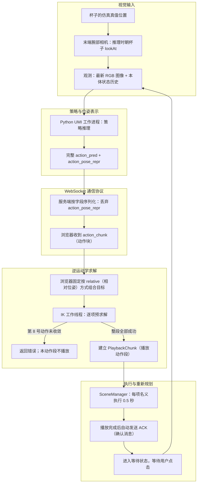

# UMI / robot-sim 系统调试统一审计与整改报告

> 审计日期：2026-10-03
> 输入材料：robot-sim/question_find.md、robot-sim/umi_system_debug_audit_v2.md
> 审计范围：UMI 策略输出、动作表示与 WebSocket 协议、浏览器端逆运动学（IK）、动作预求解与播放、相机输入、工具中心点（TCP）与相机外参、数据集与模型检查点配置
> 证据原则：以当前工作区源码、日志和用户提供的故障记录交叉核对。下文明确区分源码事实、运行记录和未验证推断。

> 术语说明：策略模型根据观测生成动作；逆运动学（IK）由目标位姿计算关节值，正向运动学（FK）由关节值计算末端位姿；求解初值是求解开始时使用的关节值；误差残差是目标与当前末端位姿之间的差；`relative` 表示“相对于当前位姿”的动作格式；本体状态数据包括机器人位置等状态；动作块是一组一起发送的动作；`ACK` 表示动作段播放完毕；模型检查点保存训练后的模型和配置。只有在说明源码字段时才保留英文名称，方便定位代码。

> 白话速读：模型一次给出 16 项动作。浏览器会先计算整段动作的关节值，再开始移动；第 9 项计算失败后，这一整段都没有播放。现有记录只能说明“为什么停下来”，还不足以说明“最初为什么会停”。

## 1. 结论摘要

- **发生了什么：** 用户提供的记录显示，第 1 帧中从 0 开始编号的第 8 号动作（即第 9 个动作）在浏览器计算关节值时停止。记录给出的末端位置误差是 6.0155 mm，超过 5 mm 通过标准；姿态误差是 0.0017429 rad，没有超过 0.01 rad 通过标准。
- **为什么没有播放：** 求解器没有把位置误差降到通过标准，也没有算出有效的关节变化，并以 `no_joint_motion` 结束。程序要求整段动作全部算出关节值后才开始播放；其中一项失败，就会取消本段播放。
- **故障根因还不知道：** 日志没有保存这一项的完整目标、求解开始时的关节值和每一轮计算结果。因此目前无法判断是初始姿态影响了求解、求解过程停住、关节限位造成影响，还是目标超出机械臂的可达范围。
- **哪些原因已排除：** 本次使用的 `relative`（相对位姿）公式与浏览器实现一致；姿态误差没有超限；前 8 项只算出了关节解，没有在本段中实际播放；播放时长也没有参与这次失败，因为失败发生在播放开始之前。
- **另一个已确认的软件问题：** 服务端没有把动作表示字段 `action_pose_repr` 传给浏览器。本次动作恰好使用浏览器默认支持的相对位姿格式，所以这个问题不是本次失败原因。播放结束后还需要人工点击，系统才会获取下一次观测。
- **建议先做什么：** 保存原始目标、初始关节值和逐轮计算结果，再用不同初始关节值重复求解同一个目标。本次误差数值来自用户提供的记录；本轮没有在代码、日志或仿真中重新运行故障。

## 2. 系统架构与控制闭环



这条链路分为五层：

1. **视觉输入：** 浏览器仿真相机采集 RGB 图像；观测数据还包含末端位置、旋转和夹爪宽度历史。推理采帧期间，相机朝杯子的仿真位置转向。
2. **策略推理：** Python 工作进程根据观测调用 UMI 策略模型，生成完整预测序列；本次预测记录有 16 项。
3. **位姿转换与通信协议：** 工作进程连同动作输出动作表示标签；服务端序列化时只保留动作数组和索引字段，没有把标签传给浏览器。
4. **逆运动学求解：** 浏览器把每项动作都相对于请求中的同一个 `startPose` 组成目标；每项成功后，将求得的关节值作为下一项的求解初值。
5. **执行与重新规划：** 只有整段 IK 都成功才建立播放动作段。播放结束后程序自动发送 `ACK`；之后需要用户点击“推理一步”，才会发送下一次观测。

证据：观测数据构造见 robot-sim/src/app/App.tsx:141-159；Python 工作进程输出见 universal_manipulation_interface/scripts/umi_sim_replay_worker.py:146-161；动作序列化见 robot-sim/server/inference_protocol.py:57-64；IK 求解与播放启动见 robot-sim/src/workers/umiIk.worker.ts:56-60,77-91,92-119,141-144、robot-sim/src/app/useInferenceReplay.ts:241-275；自动发送 ACK 和后续等待见 robot-sim/src/app/useInferenceReplay.ts:547-570。

## 3. 当前故障记录

| 字段 | 本次记录 | 证据与限制 |
|---|---|---|
| 任务序列 / 帧 / 动作 | 第 0 个任务序列；第 1 帧；第 8 号动作 | 预测日志包含任务序列和帧信息；动作编号来自用户提供的故障记录。编号从 0 开始，因此第 8 号动作实际是第 9 项。 |
| 动作表示 | relative（相对位姿） | robot-sim/server/logs/inference-predictions.jsonl:42 记录了表示标签。 |
| 动作数 | 16 项 | 同一预测日志行记录了 16 项；这只表示本次长度，不能证明所有检查点或动作块都固定为 16 项。 |
| 第 8 号动作的相对平移 | [-0.0011583543, 0.0017238006, -0.0232709367] m | 来自预测日志；这是策略给出的相对动作分量，不是 IK 残差。 |
| 目标直线位移 | 23.3634 mm | 当前末端到第 8 号动作目标点的直线距离，来自预测日志字段 `trajectory_summary`。 |
| 累计路径长度 | 24.4122 mm | 从当前末端起，沿预测目标逐点累加到第 8 号动作的路径长度；来自同一日志。 |
| 位置残差 | 6.0155 mm | 来自用户提供的故障记录；比 5 mm 容差高 1.0155 mm。当前项目没有保存本次完整浏览器错误对象。 |
| 姿态残差 | 0.0017429 rad | 来自用户提供的故障记录；低于 0.01 rad 容差。 |
| 求解器停止信息 | `no_joint_motion`；记录中的受限关节为 `joint2` / `joint3` | 来自用户提供的故障记录。源码只能说明这些字段的含义，不能复原当时每轮的状态。 |
| 是否已播放 | 当前动作段尚未开始播放 | 工作线程在第 8 号动作未收敛时立即返回 `error`；只有整段返回 `solved` 后才会建立播放动作段。 |
| 世界坐标目标 / `startPose` / 输入初值 | 未保存 | 预测日志只保留预测、表示标签和位移摘要；CSV 没有帧号或动作号。不能用旧报告中的坐标代替本次精确输入。 |

四个距离量不可混用：

- **目标直线位移（`target_displacement`）：** 当前末端到某个策略目标位置的直线距离。
- **累计路径长度（`cumulative_path`）：** 从当前末端经由前序预测目标到指定目标的折线路径长度。
- **位置残差（`position_residual`）：** 当前关节值经 FK 计算出的末端位置，与固定 IK 目标之间的欧氏距离。
- **姿态残差（`orientation_residual`）：** 当前 FK 姿态与固定 IK 目标之间的旋转误差大小。

因此，第 8 号动作的 23.3634 mm 目标直线位移、24.4122 mm 累计路径长度和 6.0155 mm 逆运动学位置残差含义不同。前两项来自预测日志；残差来自故障记录。

## 4. 已确认事实

- 当前策略已经产生动作序列；本次预测记录包含第 1 帧、16 个动作和 `action_pose_repr=relative`。证据：robot-sim/server/logs/inference-predictions.jsonl:42。
- Python 工作进程将完整预测序列转成动作块输出，没有在该处截短执行范围。证据：universal_manipulation_interface/scripts/umi_sim_replay_worker.py:146-161。
- 浏览器 IK 工作线程逐项预求解动作；失败时立即返回，只有全部动作都求解成功才发送 `solved`。证据：robot-sim/src/workers/umiIk.worker.ts:56-60,92-119,141-144。
- 当前 IK 参数为最多迭代 100 次、阻尼系数固定为 0.05、位置容差 0.005 m、姿态容差 0.01 rad、单步最大角度 0.15 rad、单步最大平移 0.01 m。证据：robot-sim/src/workers/umiIk.worker.ts:13-20。
- 求解器只有在位置和姿态两项误差分别达到容差时才判定成功。证据：robot-sim/src/core/Kinematics.ts:326-343。
- URDF 中 joint2 与 joint3 的合法范围均为 [0, 3.14] rad。证据：reBotArmController_ROS2/src/rebotarm_bringup/description/RS/urdf/ReBot_Arm_RS.urdf:193-210,307-324。
- UMI 工作进程的预测日志没有保存 IK 的 `startPose`、输入初值、最终残差或逐轮求解历史；动作 CSV 只保留最近 30 条关节记录，也没有帧号和动作号。证据：robot-sim/server/prediction_log.py:10-18、robot-sim/server/logs/README.md:3-7。
- 当前仿真推理接口发送一张 224×224 RGB 图像与最多两条本体状态记录；若只有一条记录，就会重复该记录。Python 工作进程将 RGB 解码为 224×224×3。证据：robot-sim/src/app/App.tsx:141-159、robot-sim/src/app/inferenceProtocol.ts:62-68、universal_manipulation_interface/scripts/umi_sim_replay_worker.py:58-79。
- 相机帧对象包含采集时间戳，但观测消息只发送最新 RGB 与本体状态数组，没有发送该时间戳；因此无法从当前消息还原图像和状态样本的准确采集时刻。证据：robot-sim/src/sim/sensors/WristCameraCapture.tsx:10-16,122-128、robot-sim/src/app/App.tsx:141-159、robot-sim/src/app/inferenceProtocol.ts:62-68。
- 仓库默认任务配置写有双帧图像历史、双帧本体状态历史和 16 项动作预测范围；这是模板值，不能替代当前模型检查点里保存的配置。证据：universal_manipulation_interface/diffusion_policy/config/task/umi.yaml:9-20,78-90。

上述失败残差、停止原因和受限关节信息来自用户提供的故障记录，并非当前服务端日志独立重建出的运行轨迹。

## 5. 已确认的软件缺陷

### action_pose_repr 在服务端序列化时丢失

已确认的数据路径是：

1. Python 工作进程从模型检查点配置读取动作位姿格式字段 `action_pose_repr`，并把格式标签与动作一起输出。证据：universal_manipulation_interface/scripts/umi_sim_replay_worker.py:48-50,146-159。
2. 服务端预测日志也保留该标签。证据：robot-sim/server/prediction_log.py:10-18。
3. 服务端函数 `serialize_action_chunk`（动作块序列化函数）只保留任务序列、帧号、是否最后一段和动作数组，没有传递 `action_pose_repr`。证据：robot-sim/server/inference_protocol.py:57-64。
4. 前端动作块类型 `ActionChunk` 与 IK 请求类型都没有该字段；IK 工作线程固定调用 `composePoses(startPose, deltaPose)`（按相对位姿合成目标）。证据：robot-sim/src/app/inferenceProtocol.ts:3-9,37-43、robot-sim/src/workers/umiIk.worker.ts:77-91。

这是已确认的协议缺陷。本次日志中的表示为 `relative`，浏览器的组合公式也与其一致，因此该缺陷没有导致第 8 号动作失败。如果将来模型检查点输出旧版 `rel`、绝对位姿 `abs` 或增量 `delta`，浏览器因缺少表示标签就可能按错误方式解码。修复时应让表示字段从模型输出到浏览器完整传递，并按标签选择解码方式。

## 6. 当前故障中已排除的原因

- **本次 `relative` 位姿的平移或旋转组合顺序不匹配：已排除（RULED OUT）。** UMI 对 `relative` 的解码公式为 `T_target = T_base × T_rel`；浏览器的位置计算为 `p_base + R_base × p_rel`，姿态计算为 `q_base × q_rel`。预测日志记录的表示也是 `relative`。证据：universal_manipulation_interface/diffusion_policy/common/pose_repr_util.py:62-64,94-96、robot-sim/src/utils/math.ts:111-114、robot-sim/server/logs/inference-predictions.jsonl:42。
- **姿态容差导致本次失败：已排除（RULED OUT）。** 故障记录中的 0.0017429 rad 小于工作线程的 0.01 rad 阈值；超出阈值的是位置残差。证据：robot-sim/src/workers/umiIk.worker.ts:13-20。
- **第 0 至第 7 号动作已在本动作段中播放：已排除（RULED OUT）。** IK 工作线程必须等所有动作都成功后才发送 `solved`；播放状态只会在收到该消息后建立。证据：robot-sim/src/workers/umiIk.worker.ts:92-119,141-144、robot-sim/src/app/useInferenceReplay.ts:241-275。
- **0.5 秒的播放时长直接导致本次 IK 停止：已排除（RULED OUT）。** 第 8 号动作在播放动作段建立前就已失败，当时播放时钟尚未启动。证据：robot-sim/src/viz/SceneManager.tsx:35-36,57-90。
- **`camera.lookAt(cup)` 直接改变已交给求解器的 IK 方程：已排除（RULED OUT）。** 相机可能通过策略输入影响此前生成的动作目标；目标给定后，IK 求解器只使用该目标和初始关节值求解，不能用相机朝向解释固定目标下的求解停止。

UMI 中两种名称相近的位姿表示不能混为一谈：

- **`relative`（相对位姿）：** 编码为 `T_rel = inverse(T_base) × T_pose`，解码为 `T_target = T_base × T_rel`。因此，位置为 `p_target = p_base + R_base × p_rel`，姿态为 `R_target = R_base × R_rel`。当前浏览器的 `composePoses` 与这组解码公式一致。
- **`rel`（旧版相对位姿）：** 旧版编码为 `p_rel = p_pose - p_base`、`R_rel = R_pose × inverse(R_base)`，解码为 `p_target = p_base + p_rel`、`R_target = R_rel × R_base`。它的平移不旋转到 base 局部坐标，姿态旋转的乘法顺序也不同。

公式依据：universal_manipulation_interface/diffusion_policy/common/pose_repr_util.py:53-64,85-96；robot-sim/src/utils/math.ts:111-114。本次运行标签为 `relative`，因此相对位姿公式不匹配这一说法已排除；但协议丢字段仍可能让浏览器错误解释未来的 `rel` 或其他表示。

以上裁决只针对本次失败的直接机制。视觉输入、协议表示、整段拒绝和重规划节奏仍是系统问题。

## 7. IK 逆运动学求解器审计

### 求解器实际如何计算

`Kinematics.solveIK` 使用阻尼最小二乘法，并在关节到达限位时暂时排除继续朝边界外移动的关节。大致流程如下：

```text
q = 将输入关节初值限制在合法范围内
末端位姿 = 根据 q 用正向运动学计算末端位置和姿态
残差 = 目标与当前末端位姿的位置差和姿态差

当尚有迭代次数且位置、姿态误差未同时满足容差时：
  误差向量 = 位置误差与姿态误差合成的数值
  J = 当前关节到末端的雅可比矩阵
  解 (J × Jᵀ + 阻尼系数² × I) × y = 误差向量
  deltaQ = 根据误差计算出的关节变化量
  对已到限位且本轮还要向边界外移动的关节：
    暂时排除该关节
    用其余关节重新计算 deltaQ
  限制每个关节的单步幅度
  将 q + deltaQ 限制在各关节的合法范围内
  若所有可动关节的实际变化量都小于 1e-10：
    以 no_joint_motion 退出
  否则接受新的 q，重新计算末端位姿和残差

返回最终关节值、是否收敛、迭代次数、残差、退出原因和求解期间累计受限的关节
```

关键实现见 robot-sim/src/core/Kinematics.ts:154-237。IK 工作线程的实际参数见 robot-sim/src/workers/umiIk.worker.ts:13-20。

### 源码能够确认的内容与本次运行的未知项

- **源码事实：** 每次产生非零更新后，求解器都会接受新关节值并重算残差，但不会检查残差是否比上一次更小。实现没有保存历史最佳状态、回滚、线搜索或自适应阻尼；阻尼系数固定为 0.05。
- **源码事实：** 若关节已到限位且本轮还要向边界外移动，求解器会暂时排除该关节，再用其余关节重新计算。之后会限制各关节单步幅度，并把结果夹回合法范围。
- **源码事实：** `no_joint_motion` 表示单步限制和关节限位处理之后，所有参与求解的关节实际变化都小于 1e-10。此时程序直接退出，不会再执行一次正向运动学计算来更新最终残差。
- **源码事实：** `blockedJoints` 是整个求解过程中累计记录的关节名。某个关节曾在某轮触及限位，不代表它一定在最终触发 `no_joint_motion` 的那一轮受阻。
- **本次运行未知：** 没有逐轮的关节值、变化量、参与求解的关节集合、限位裁剪标记或残差，因此无法判断本次求解是否发生残差增大、移动方向受限或局部停滞。

实现会继续接受可能让残差变大的更新，这是求解器设计上的风险；现有证据不能证明本次失败确实发生了残差恶化。拿到逐轮记录前，不能据此认定根因。

## 8. 失败目标与关节限位分析

| 判断 | 状态 | 证据与限制 |
|---|---|---|
| joint2 / joint3 在 URDF 中的下限为 0 rad | 已确认（CONFIRMED） | 两轴范围均为 [0, 3.14] rad；见 ReBot_Arm_RS.urdf:193-210,307-324。 |
| 当前最后一条 CSV 中 joint2 / joint3 为 0 | 已确认（CONFIRMED） | 第 132 步的两轴值为 0；见 robot-sim/server/logs/inference-actions.csv:31。CSV 没有帧号和动作号。 |
| 第 132 步就是本次失败返回的完整关节初值 | 较可能（LIKELY） | 失败处理路径会回传并记录错误中的关节值，但 CSV 只有行序，没有帧号和动作号。见 robot-sim/src/app/useInferenceReplay.ts:115-138、robot-sim/server/inference.py:108-121、robot-sim/server/logs/README.md:3-5。 |
| 关节限位导致本次 `no_joint_motion` | 可能（POSSIBLE） | 关节下限与记录中的受限关节相符；缺少第 8 号动作的输入初值、逐轮关节变化、活动关节集合和限位裁剪历史。 |
| 第 8 号动作目标在当前初值和求解器下可达 | 尚不能判断（INCONCLUSIVE） | 完整世界坐标目标、`startPose`、输入初值和逐轮求解轨迹均未保存。 |
| 第 8 号动作目标在所有合法关节姿态下都不可达 | 尚不能判断（INCONCLUSIVE） | 没有对同一目标使用多个初值求解的结果，也没有独立可达性分析。 |

joint2 / joint3 位于下限时仍可向正方向进入合法范围；CSV 中其他四轴也没有处于各自边界。故障记录中的 `blocked joints` 表示求解期间检测到关节运动方向受限，不表示机械臂所有自由度都被锁住。`no_joint_motion` 也不能单独证明目标在物理上不可达。

旧稿中的世界坐标起点、目标位置和迭代次数无法用当前保存的材料复核，因此不作为本报告事实。目前只能确认策略给出的相对动作分量和 23.3634 mm 目标直线位移；还需要原始 `startPose` 才能重建世界坐标目标。

## 9. 预测时域与执行时域的区别

| 概念 | 含义 | 当前 robot-sim | UMI 官方实机评估程序 |
|---|---|---|---|
| 动作预测长度（`action_horizon`） | 策略一次生成多少个未来动作 | 当前预测日志长度为 16；工作进程发送完整序列 | 从模型检查点配置读取预测序列；检查点内部配置尚未核实 |
| 执行时域 | 获取下一次观测前实际播放的动作范围 | 只有整段 IK 成功后才播放整个动作块；本次失败，因此播放 0 项 | 根据动作时间戳筛选仍在未来的目标，再提交给控制器 |
| 重新规划时域 | 到下一次观测与策略推理之间的时间或步数 | 播放整段并自动发送 ACK 后，仍需人工点击下一步 | 默认频率为 10 Hz、每次推进 6 个时隙，名义上约 0.6 秒后进入下一轮 |

这三个概念含义不同。仓库默认配置 universal_manipulation_interface/diffusion_policy/config/task/umi.yaml:9-11 写有 `action_horizon: 16`，但该默认值不能代替当前模型检查点内部配置。当前预测日志中的 16 项长度见 robot-sim/server/logs/inference-predictions.jsonl:42。

官方实机评估程序中的 `steps_per_inference=6` 与 `frequency=10` 是时间调度参数。程序根据动作时间戳选出仍在未来的目标并提交；如果推理超过时间预算，就把最后一个目标安排到下一个可用时隙。因此不能简单理解为“每轮固定执行六条指令”。证据：universal_manipulation_interface/scripts_real/eval_real_umi.py:86-89,117,412-435,479-481。

`eval_real_umi.py` 中的 `policy.num_inference_steps=16` 指 DDIM 扩散采样的迭代次数，不是动作预测时域。证据：universal_manipulation_interface/scripts_real/eval_real_umi.py:205-212。

## 10. 动作块预求解与整段拒绝机制

### 当前执行方式

当前工作线程对完整的 `actions` 数组逐项求解，并将每项算出的关节值作为下一项的初值。第 8 号动作未收敛时，工作线程立即返回；之前第 0 至第 7 号动作的关节解只保存在内存中，没有进入 `PlaybackChunk`（播放动作段）。只有整段全部求解成功后才开始播放。证据：robot-sim/src/workers/umiIk.worker.ts:50-56,77-91,92-119,122-144、robot-sim/src/app/useInferenceReplay.ts:241-275。

因此，同一个动作块中较后的目标求解失败，会导致较早且已经求解成功的目标也无法执行。这是已确认的整段拒绝行为，不能据此推断第 0 至第 7 号动作已经带来实际运动。

### 故障诊断建议

先完整保存动作、`startPose`、求解初值、解码后的目标、每项求解结果、最终关节值、残差、受限关节、退出原因和 IK 参数。能够复现失败后，再判断问题来自初值、求解器更新还是关节限位；不要先把 5 mm 的位置容差放宽来掩盖停滞。

### 架构改进建议

故障能够复现后，再区分策略输出的完整范围与实际执行范围。保留完整预测序列作为候选，只对计划执行的短时域求解和播放，之后获取新观测并重新规划。这样可以缩小“较后目标失败导致近期动作全部停止”的范围。新方案仍须明确短段求解失败时如何处理，不能把未经求解的目标送去播放。

## 11. 观测与重新规划的时序

| 环节 | 当前 robot-sim | UMI 官方实机评估程序 |
|---|---|---|
| 获取观测 | 最新的 224×224 RGB 图像与最多两条机器人本体状态记录；发送后等待策略返回 | 从实机相机与机器人状态取得带时间信息的观测；图像和本体状态历史长度由加载的模型配置决定 |
| 推理频率 | 不会自动连续循环；成功播放一个动作块后等待人工点击 | 默认控制频率为 10 Hz，每次按 `steps_per_inference=6` 推进时间轴 |
| IK 与动作调度 | 播放前先对整段动作求解 | 为预测动作标注时间戳，筛出未来目标并提交给控制器 |
| 单项动作时间 | 每项名义 0.5 秒；SceneManager 每帧最多累计 0.05 秒仿真进度 | 按 0.1 秒控制时隙调度；UR5 插值控制器频率为 500 Hz |
| 再次观测 | 16 项动作全部求解并播放后自动发送 ACK，再等待人工点击；播放中不会自动重新推理 | 一个时间周期结束后获取下一次观测并重新推理 |
| 本次失败的影响 | 第 8 号动作在播放前失败，本段没有播放任何 0.5 秒动作 | 不适用 |

如果 16 项动作全部通过 IK，名义播放时间为 16 × 0.5 = 8 秒；实际经过的时间可能更长，因为每帧的仿真进度最多增加 0.05 秒。这个 8 秒只适用于完整动作段成功播放的情况，不适用于本次失败段。官方实机评估程序按时间戳安排动作，并以较短时间间隔推进；两者重新获取观测和制定动作的节奏不同。证据：robot-sim/src/viz/SceneManager.tsx:35-36,57-90、universal_manipulation_interface/scripts_real/eval_real_umi.py:86-89,412-435,479-481、universal_manipulation_interface/umi/real_world/umi_env.py:231-244。

## 12. 相机与视觉输入分布审计

| 属性 | 当前 robot-sim | UMI 数据与实现 | 审计判断 |
|---|---|---|---|
| 输出尺寸 | 浏览器渲染为 224×224 RGB，送入工作进程前按 224×224×3 解码 | 示例 cup_in_the_wild 的 camera0_rgb 为 224×224×3、uint8；实机输入按加载配置中的目标尺寸处理 | 分辨率相同不代表图像分布相同 |
| 投影与镜头 | Three.js 透视相机参数为 60°，渲染区域为正方形 | 仓库 GoPro 标定样例标记为鱼眼镜头并含畸变参数；实机评估程序可选鱼眼矫正 | 没有证据证明“当前策略输入等于 155° 透视相机”；检查点使用的镜头与矫正选项未知 |
| 相机安装 | 相机挂在机器人 `tipLink`，局部位置为 (0, 0, 0.055)，局部旋转为 (0, 1.355-π/2, 0) | UMI 数据计划与实机配置取决于设备安装变换 | 仿真与数据采集相机之间的外参尚未对齐 |
| 运行时朝向 | `inferenceActive`（推理进行中）时读取杯子的世界坐标，把目标设为 (x, y+0.039, z)，再调用 `camera.lookAt`；非推理时恢复固定局部旋转 | UMI 实机相机朝向由实际安装和观测变换决定；所查代码没有根据仿真杯子真值主动转动相机的逻辑 | 仿真相机受杯子真值引导已确认；它是否影响策略表现仍需对照实验 |
| 图像处理 | 从 `RenderTarget`（渲染目标）读回 RGB 并垂直翻转；该路径没有鱼眼矫正、裁剪或遮罩 | UMI 实时与离线路径支持缩放、鱼眼矫正、镜像、镜像裁剪和预定义遮罩；具体选项由运行参数决定 | 只能确认仓库支持这些处理分支，不能据此推断当前检查点用了哪一种 |
| 数据增强 | 当前仿真采集没有应用训练增强 | 仓库部分训练配置含 `RandomCrop`（随机裁剪）等增强 | 示例训练配置不代表当前检查点的训练流程 |

源码证据：仿真相机与图像读回见 robot-sim/src/sim/sensors/WristCameraCapture.tsx:29-32,61-71,86-120；实机图像处理分支见 universal_manipulation_interface/umi/real_world/umi_env.py:117-175；实时鱼眼矫正参数为可选项，见 universal_manipulation_interface/scripts_real/eval_real_umi.py:91-95,120-130；标定样例见 universal_manipulation_interface/example/calibration/gopro_intrinsics_2_7k.json:3-16；离线处理见 universal_manipulation_interface/scripts_slam_pipeline/07_generate_replay_buffer.py:58-66,215-235；示例随机裁剪配置见 universal_manipulation_interface/diffusion_policy/config/train_diffusion_unet_timm_umi_workspace.yaml:63-65。

**当前结论：尚不能判断（INCONCLUSIVE）。** 源码可确认 robot-sim 使用 60° 透视相机、垂直翻转图像，并在推理时调用 `lookAt(cup)`；仓库还支持鱼眼矫正、图像裁剪和遮罩等处理。但当前模型检查点的 cfg、训练图像和实际送入策略模型的 RGB 尚未对照。视觉输入差异可能改变策略生成的目标；目标确定后，它不能直接解释固定目标下 IK 为何停止移动。

## 13. TCP 与末端几何关系

| 参考系 | 当前证据 | 含义 |
|---|---|---|
| link6 / 末端支路 | URDF 将 gripper_end 固定连接到 link6，平移 0.16621 m，rpy 为 (π, -π/2, 0)；解析器从多个末端分支中选择共同的 `tipLink` | robot-sim 的 `RobotModel.getLinkPose()` 与 IK 都使用该末端参考链接 |
| gripper_end | 当前 RS 仿真的观测与 IK 使用同一个末端参考；腕部相机也安装在末端链接上 | 仿真内部使用的末端参考一致 |
| UMI 实机 TCP | umi_env.py 默认 `tcp_offset=0.21 m` | 这是该控制器安装定义中的偏移量 |
| 数据集计划 TCP | 06_generate_dataset_plan.py 默认 `tcp_offset=0.205 m`，描述为夹爪尖端到安装螺丝的距离 | 与实机控制器偏移采用的参考点定义不同，不能直接相减作为跨系统标定结果 |

证据：reBotArmController_ROS2/src/rebotarm_bringup/description/RS/urdf/ReBot_Arm_RS.urdf:603-612、robot-sim/src/utils/urdfParser.ts:195-228,274-279、robot-sim/src/core/RobotModel.ts:64-65、robot-sim/src/app/App.tsx:111-112,141-159、robot-sim/src/core/Kinematics.ts:142,149、robot-sim/src/sim/sensors/WristCameraCapture.tsx:75-82、universal_manipulation_interface/umi/real_world/umi_env.py:70,231-244、universal_manipulation_interface/scripts_slam_pipeline/06_generate_dataset_plan.py:85-106。

跨系统变换 `T_UMI_TCP_to_gripper_end` 与 `T_TCP_camera` 仍未标定，状态为**未标定 / 未知（UNCALIBRATED / UNKNOWN）**。这关系到训练几何对齐和仿真到实机迁移，不能据此判定本次纯仿真 IK 目标坐标有误。

## 14. 数据集与模型检查点的待确认项

当前工作区已检查的 cup_in_the_wild.zarr.zip 元数据包含：

- camera0_rgb：数组形状为 [699432, 224, 224, 3]，分块大小为 [1, 224, 224, 3]，数据类型为 uint8，压缩器为 JPEG XL。
- robot0_eef_pos：数组形状为 [699432, 3]。
- robot0_eef_rot_axis_angle：数组形状为 [699432, 3]。
- robot0_gripper_width：数组形状为 [699432, 1]。
- meta/episode_ends：数组形状为 [1447]。
- 还包含 robot0_demo_start_pose 与 robot0_demo_end_pose。

证据来自 ZIP 内成员 universal_manipulation_interface/data/cup_in_the_wild.zarr.zip[data/camera0_rgb/.zarray]、[data/robot0_eef_pos/.zarray]、[data/robot0_eef_rot_axis_angle/.zarray]、[data/robot0_gripper_width/.zarray]、[meta/episode_ends/.zarray]。这些元数据没有 Markdown 行号。已检查的 Zarr 数组中没有杯子的世界坐标、采样时间戳或帧率数组，因此不能据此确认某个仿真杯子坐标是否出现在训练数据中。

该归档的 RGB 元数据还声明使用 JPEG XL，且 `lossless=false`（有损压缩）。question_find.md:981-1009 曾记录本机 Zarr 编解码器注册表无法读取 imagecodecs_jpegxl。本轮只核对了归档元数据，没有重新检查 Conda 解码环境，因此不把旧报错列为当前已确认的阻塞问题。提取训练帧时应重新检查。

服务端从 universal_manipulation_interface/data/pretrained/cup_wild_vit_l_1img.ckpt 加载模型，工作进程调用 `load_policy` 读取检查点内部配置。证据：robot-sim/server/load_model.py:18,86-95、universal_manipulation_interface/scripts/umi_sim_replay_worker.py:41-50。本报告没有读取检查点内部的配置。仓库默认 YAML 中的 `dataset_frequeny: 0`、图像历史长度 2、本体状态历史长度 2、动作预测范围 16 和默认位姿表示都只是模板，不能替代检查点中的真实配置；当前配置文件路径为 universal_manipulation_interface/diffusion_policy/config/task/umi.yaml:6-20,78-90。

| 未知项 | 当前证据状态 |
|---|---|
| 检查点实际配置、训练工作区与数据来源 | 未知（UNKNOWN）；本次没有读取检查点中的配置。 |
| 检查点实际使用的图像预处理、数据增强、镜头模型与训练帧 | 未知（UNKNOWN）；仓库源码只能证明存在若干可选处理方式。 |
| 训练采样频率与动作时间步 | 未知（UNKNOWN）；数据成员没有时间戳或帧率，`dataset_frequeny: 0` 不能证明实际采样频率。 |
| 当前仿真图像历史长度是否符合该检查点要求 | 尚不能判断（INCONCLUSIVE）；前端只发送一张最新 RGB，工作进程以单帧图像调用辅助函数，辅助函数保留输入帧数；默认 YAML 图像历史长度为 2。尚未读取检查点配置，因此不知道是否符合当前模型要求。证据：universal_manipulation_interface/scripts/umi_sim_replay_worker.py:58-63、universal_manipulation_interface/umi/real_world/real_inference_util.py:76-91、universal_manipulation_interface/diffusion_policy/config/task/umi.yaml:9-20。 |
| 仿真杯子的精确位置是否出现在训练数据中 | 未知（UNKNOWN）；所查数据没有杯子世界坐标。 |
| 跨系统 TCP 与相机外参 | 未知 / 未标定（UNKNOWN / UNCALIBRATED）；没有完整的刚体变换标定。 |
| 本次失败使用的 IK 目标、`startPose` 和第 8 号动作初值 | 未知（UNKNOWN）；现存预测日志没有这些 IK 运行输入。 |

补充：universal_manipulation_interface/scripts_real/eval_real_umi.py 中的 `num_inference_steps=16` 是 DDIM 采样迭代次数，不能用来推断动作序列长度或训练采样频率，见 eval_real_umi.py:205-212。

## 15. 系统问题汇总表

状态说明：已确认（CONFIRMED）、较可能（LIKELY）、可能（POSSIBLE）、尚不能判断（INCONCLUSIVE）、已排除（RULED OUT）、未知（UNKNOWN）。优先级中 P0 最高，其次为 P1，再次为 P2。

| 问题 | 所属环节 | 状态 | 证据 | 能否解释本次故障 | 优先级 |
|---|---|---|---|---|---|
| 第 8 号动作因位置残差超容差、`no_joint_motion` 而停止 | 逆运动学 | 已确认（CONFIRMED） | 用户故障记录；阈值和退出逻辑见 umiIk.worker.ts:13-20、Kinematics.ts:211-228 | 能解释该动作为何未收敛；更深层根因未知 | P0 |
| 当前 `relative` 公式与浏览器的位姿组合方式不匹配 | 位姿转换 | 已排除（RULED OUT） | UMI pose_repr_util.py:62-64,94-96；浏览器 math.ts:111-114；预测日志记录了运行标签 | 否 | P2 |
| 服务端转发时丢弃 `action_pose_repr` | 通信协议 | 已确认（CONFIRMED） | inference_protocol.py:57-64；前端类型没有该字段 | 不是本次样本的原因；未来其他位姿表示有风险 | P1 |
| 第 132 步关节状态与本次失败返回有关 | 日志 / 关节状态 | 较可能（LIKELY） | q2/q3=0，且错误处理路径吻合；但 CSV 没有帧号和动作号 | 可作为限位旁证，不能单独说明停滞 | P1 |
| joint2 / joint3 限位导致本次停滞 | 逆运动学 / 关节限位 | 可能（POSSIBLE） | URDF 下限与 CSV 末行有关；缺少真实输入初值和逐轮记录 | 可能，但尚未证明 | P1 |
| 第 8 号动作目标在当前初值和求解器下可达 | 逆运动学 | 尚不能判断（INCONCLUSIVE） | 目标、初值和完整失败记录未保存 | 目前无法判断 | P1 |
| 第 8 号动作目标在所有合法关节值下都不可达 | 机器人模型 / 可达性 | 尚不能判断（INCONCLUSIVE） | 没有对同一目标使用多个初值求解的结果或独立分析 | 可能，但尚未证明 | P1 |
| 求解器本次确实接受了让残差变大的更新 | 逆运动学求解器 | 可能（POSSIBLE） | 源码没有要求残差下降；缺少逐轮运行记录 | 可能，但没有本次轨迹证据 | P1 |
| 整段预求解，单点失败后整段拒绝 | 执行架构 | 已确认（CONFIRMED） | 工作线程仅在整段成功后发送 `solved` | 能解释前 8 项为何没有播放 | P1 |
| 自动发送 ACK 后需要人工点击才能获取下一次观测 | 重新规划 | 已确认（CONFIRMED） | useInferenceReplay.ts:510-529,547-570 | 不能解释第 8 项在播放前失败 | P2 |
| 仿真相机在推理时朝杯子刚体转向 | 视觉输入 | 已确认（CONFIRMED） | WristCameraCapture.tsx:86-100 | 可能影响策略此前生成的目标；不能解释固定目标下求解器停止 | P2 |
| 当前检查点与仿真策略输入确有视觉分布差异 | 视觉输入 / 模型检查点 | 可能（POSSIBLE） | 已知源码存在不同图像处理路径，但没有检查点配置或训练帧对照 | 可能间接改变目标；尚未确认 | P2 |
| 当前单帧 RGB 与检查点要求的图像历史长度不一致 | 观测 / 模型检查点 | 可能（POSSIBLE） | 当前工作进程只传 1 帧，默认模板历史长度为 2；检查点配置未读取 | 可能影响策略输入；不能解释目标生成后的求解停滞 | P2 |
| robot-sim 末端参考与 UMI 实机 TCP 之间的变换 | 几何关系 | 未知（UNKNOWN） | 仿真内部一致，跨系统变换尚未标定 | 不能据此判定本次纯仿真故障 | P2 |
| 观测状态与 IK 请求中的 `startPose` 存在时间偏差 | 观测 / 位姿转换 | 可能（POSSIBLE） | Python 根据观测位姿还原动作，浏览器使用动作块到达时的 tcpPose；两者没有共同记录 | 可能改变组合出的目标；缺少运行证据 | P2 |
| 当前检查点配置、训练频率和数据来源 | 模型检查点 / 数据集 | 未知（UNKNOWN） | 只检查了仓库模板与样例数据 | 不能单独解释本次求解停滞 | P2 |

## 16. 最小复现实验

以下实验按信息增益排序。本轮没有运行实验，也没有修改代码。

### 实验 1：完整记录失败输入

针对第 1 帧、第 8 号动作，保存一份完整记录：

- `frame_index`、`action_index`、`action_pose_repr`。
- 原始相对动作、观测中的 `startPose`、解码后的世界坐标目标位姿。
- 求解第 8 号动作时实际使用的关节初值，以及第 7 号动作的求解结果。
- 输出关节值、位置与姿态残差、迭代次数、受限关节、退出原因和 IK 参数。
- 每条记录关联同一个推理请求编号（`inference request id`），避免把 CSV 中相邻行误认作输入初值。

先确保能用相同输入重放失败，才能解释求解器为何停止。

### 实验 2：固定目标并尝试多个初值

固定实验 1 保存的同一个世界坐标目标，分别使用：

- 原始故障初值。
- 第 7 号动作求解成功后的关节值。
- joint2 / joint3 合法范围内的初值。
- 中立或参考姿态初值。
- 少量处于合法范围内的关节扰动初值。

记录是否收敛、最终残差、迭代次数、关节解和限位状态。找到一个解只能证明至少发现了一组可行解；多个初值都失败仍不足以从数学上证明目标不可达。

### 实验 3：记录每轮求解过程

使用原始初值和同一个目标，记录每一轮的：

- 更新前关节值、原始关节变化量、限幅后的变化量、更新后关节值。
- 位置残差和姿态残差。
- 参与求解的关节集合、每轴限位裁剪标记、距关节限位的余量。
- 迭代序号和退出原因。

用逐轮记录区分残差持续下降、来回振荡、关节更新停滞和限位裁剪；不要只凭最终的 `blockedJoints` 推断最后一轮发生了什么。

### 实验 4：验证相对位姿转换

使用同一个非零相对动作和非零起始平移，分别测试：

1. 起始姿态为单位旋转。
2. 起始姿态绕 Z 轴旋转 90°。

直接比较官方 Python 函数 `convert_pose_mat_rep` 与浏览器函数 `composePoses` 得到的位置和旋转矩阵。另行测试旧版 `rel`，并验证 `action_pose_repr` 能完整经过 WebSocket 收发。当前已核对 `relative` 数学公式一致；该实验用于后续回归检查和协议修复验收。

### 实验 5：检查模型检查点配置

读取服务实际加载的模型检查点配置，并记录：

- 策略动作预测范围、`num_inference_steps`。
- 观测和动作采用的位姿表示。
- 图像与本体状态历史长度、图像形状配置（`shape_meta`）。
- 数据集路径、训练预处理和数据增强配置。

将检查结果与仓库默认配置 universal_manipulation_interface/diffusion_policy/config/task/umi.yaml 分开保存。

### 实验 6：提取并检查训练图像

先根据检查点配置确认训练数据来源，再从对应的 Zarr 数据集中选取多个操作片段的起始、中间和结束图像。检查送入模型前的图像、镜头效果和物体像素尺寸。目前的 cup_in_the_wild 只能作为样例，不能预先假定它就是该检查点的训练数据。

### 实验 7：保存仿真实际发送给策略模型的输入

保存最终发送给策略模型的 RGB 字节，以及对应的机器人本体状态和图像形状信息。应使用 Python 工作进程实际解码后的 224×224 RGB；浏览器界面的相机预览截图不能替代网络中实际发送的图像。

### 实验 8：对照训练图像与仿真输入

在相同机器人状态与杯子位置下，对比训练图像和仿真实际输入：

- 杯子和夹爪的像素尺寸与画面位置。
- 透视或鱼眼投影、畸变和可视范围。
- 裁剪、缩放、RGB 通道顺序、垂直翻转、镜像和遮罩。
- 相机相对于 TCP 的位姿、背景覆盖范围，以及相机是否受杯子仿真真值位置引导。

该实验用于判断策略模型输入是否存在差异，不能替代 IK 可达性实验。

## 17. 整改路线图

以下是建议顺序，不表示本轮已实施代码整改。

| 阶段 | 工作 | 验收依据 |
|---|---|---|
| 阶段 0：补齐运行记录 | 持久化保存动作块、IK 输入和退出状态 | 一次运行即可还原 `startPose`、目标、初值、结果和失败原因 |
| 阶段 1：复现原始失败 | 用第 1 帧、第 8 号动作的原始输入重放 | 原始目标和初值能够再次触发相同失败，或稳定求解成功 |
| 阶段 2：分析逆运动学 | 对同一目标尝试多个初值，并记录逐轮计算过程 | 能区分初值敏感、求解停滞和可达性问题 |
| 阶段 3：修复通信协议 | 从模型输出到浏览器保留并处理 `action_pose_repr` | 工作进程、服务端和浏览器往返传递的表示标签一致 |
| 阶段 4：增加回归检查 | 检查 `relative` / `rel` 位姿转换与协议传递 | 单位旋转和绕 Z 轴旋转 90° 时的结果符合对应公式 |
| 阶段 5：区分预测与执行范围 | 分别表达完整预测范围和计划执行范围 | 调整预测范围不会隐式扩大单次执行范围 |
| 阶段 6：缩短重新规划间隔 | 先执行较短动作段，再获取新观测并重新预测 | 观测、执行和重新规划周期有稳定记录 |
| 阶段 7：对比视觉输入 | 提取训练图像并保存仿真实际发送给模型的输入 | 使用相同预处理流程进行图像对照 |
| 阶段 8：标定 TCP 与相机外参 | 测量并记录法兰（flange）、gripper_end、TCP、相机坐标原点之间的刚体变换 | 坐标方向、单位和标定结果都有记录且可复核 |
| 阶段 9：固定相机安装关系 | 完成阶段 8 后移除杯子世界坐标引导，使用已标定的相机与 TCP 外参 | 相机姿态由末端位置和固定安装关系决定 |
| 阶段 10：评估策略模型 | 坐标、协议、IK、时序和输入均可验证后再评价模型 | 评估结果能区分策略模型与执行系统的影响 |

不要用放宽容差代替实验 1 至 3。缩短执行时域和允许部分动作继续执行都会改变行为，宜先复现原始故障，再逐步验证。

## 18. 当前结论

1. 本次预测日志证明 UMI 策略模型已经产生完整动作序列；现有证据不支持策略推理进程崩溃。
2. 用户提供的故障记录显示，第 8 号动作在浏览器端 IK 预求解时因 `no_joint_motion` 停止；位置残差超过 5 mm 容差，姿态残差仍在容差内。
3. 第 8 号动作所属的整段没有播放；第 0 至第 7 号动作只有预求解结果，本段中没有发生实际运动。
4. 当前没有证据证明第 8 号动作目标超出 ReBot RS 的合法关节范围；目标可达性尚不能判断。
5. joint2 / joint3 的 0 rad 下限和 CSV 末行值值得优先验证，但不足以确认它们就是根因。
6. 当前运行使用的 `relative` 位姿公式与浏览器实现一致；旧稿中“相对位姿左右乘仍可能错误”的判断应由此结论替代。
7. 服务端转发时丢弃 `action_pose_repr` 是已确认的软件缺陷；本次样本使用 `relative`，因此该缺陷没有导致此次失败。
8. 每项名义播放 0.5 秒、16 项合计约 8 秒，只适用于整段 IK 成功后的播放过程，不是第 8 号动作在播放前失败的原因。
9. robot-sim 当前采用整段预求解、整段播放、自动发送 ACK 后等待人工点击的分段循环；这与官方实机评估程序按时间戳调度、短周期重新规划的方式存在架构差异。
10. `camera.lookAt(cup)`、检查点对应的视觉输入差异、图像历史长度以及 TCP / 相机外参都还需要验证；它们不能写成固定 IK 目标下 `no_joint_motion` 的已确认根因。
11. 下一步优先保存完整失败输入和逐轮求解记录，再用同一个目标尝试多个合法初值。只有这些证据才能区分求解停滞、找到可行解和目标不可达。

### 主要冲突裁决

| 原有表述 | 新证据 | 本次统一结论 |
|---|---|---|
| 相对位姿左右乘或位置坐标系仍高度可疑 | 本次运行使用 `relative`；UMI 解码公式与浏览器实现一致 | 本次故障中已排除；仍保留协议对旧版 `rel` 等表示的风险 |
| joint2 / joint3 下限就是根因 | URDF 下限与 CSV 末行均为 0，但 CSV 没有动作索引，实际初值和逐轮移动方向缺失 | 关节限位是可能的停滞因素，根因尚未确认 |
| 第 8 号动作目标不可达 | 完整目标、`startPose`、初值和多初值求解结果均未保存 | 目标是否可达尚不能判断 |
| `lookAt(cup)` 造成 6 mm IK 残差 | 相机先影响策略输入；目标给定后求解器使用固定目标和初值 | 视觉输入仍需评估，但不能解释求解器为何直接停止 |
| 仿真 gripper_end 与 UMI TCP 不一致导致本次纯仿真失败 | robot-sim 的观测与 IK 使用同一个末端参考；跨系统变换尚未标定 | 仿真内部参考一致；仿真到实机的几何关系仍未知 |
| 开环执行 8 秒直接导致第 8 号动作 IK 失败 | 第 8 号动作在任何播放开始前就已预求解失败 | 控制节奏是独立系统问题，不是本次播放前失败的原因 |
| 旧报告中的世界坐标起点、目标和 15 次迭代可作为本次事实 | 当前预测日志和 CSV 未保存相应输入及完整错误对象 | 不纳入当前结论，待完整记录原始故障后再核实 |
| v2 文档引用了 universal_manipulation_interface/task/umi.yaml | 当前工作区模板实际位于 universal_manipulation_interface/diffusion_policy/config/task/umi.yaml | 统一使用当前存在的配置路径；模板仍不能代替检查点内部配置 |
