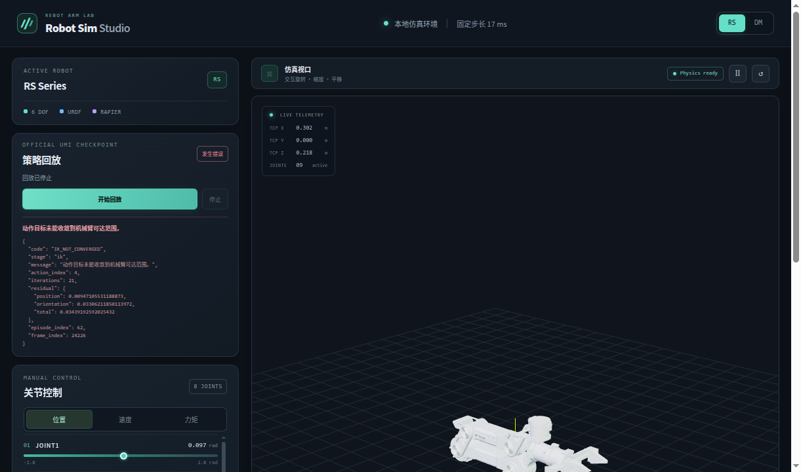
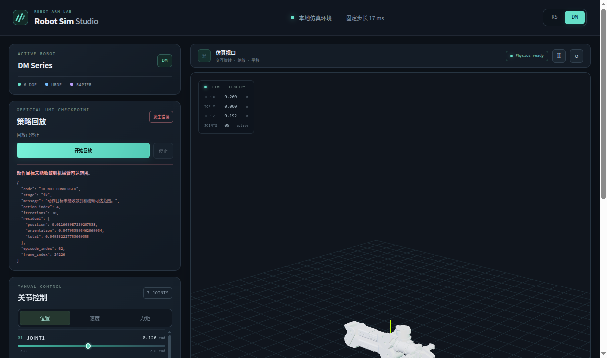

# 官方 UMI 回放联调截图

截图来自官方 checkpoint `cup_wild_vit_l_1img.ckpt` 的本地 WebSocket 回放。RS 和 DM 都成功播放并确认了 episode 62 的前两块动作；第三块在 IK 残差超过 3 毫米回放容差后停止，并在面板展示了动作索引、迭代次数和残差。

RS 在 `frame_index=24226` 的残差为位置 9.47 毫米、姿态 0.0331 弧度：

DM 在 `frame_index=24226` 的残差为位置 11.67 毫米、姿态 0.0480 弧度：

