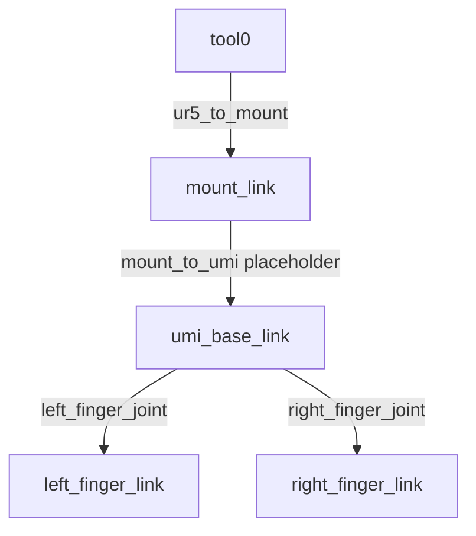

# UR5 + UMI CAD 末端资产

该目录保存 Phase 3C-1 新建的组合模型。原始 `ur5.urdf`、`umi-gripper.urdf` 和 Phase 3B 组合文件均未改动。

## 资产与坐标

| 文件 | 来源与坐标 | 输出单位 |
|---|---|---|
| `meshes/mount.stl` | 从 PartStudio 导出 STL 的 mount 三角面组中提取，保留 CAD 原点和轴向 | m |
| `meshes/umi_base.stl` | 复用旧 UMI `base_link.stl`，顶点不变 | m |
| `meshes/gopro.stl` | 复用旧 GoPro visual 网格，顶点不变 | m |
| `meshes/left_finger.stl` | 单指 CAD 网格，按旧 UMI URDF 的左指 visual 位姿烘焙到 finger link 坐标 | m |
| `meshes/right_finger.stl` | 左指网格关于 finger joint 坐标系 `x=0` 离线镜像 | m |

`mount-partstudio.stl` 原始导出包含整个 Part Studio。三角面 `[127732, 140750)` 与 `gripper_mount` 的 198 个 BREP 顶点、包围盒及闭合拓扑相符。其他实体在该分段没有独立顶点匹配；主组件 `1` 与它仅有 4 个接口共点。提取后将毫米坐标乘以 `0.001`，转为 URDF 使用的米。

单指 CAD 与旧 UMI 指夹网格表面最大差约 `0.14 mm`。旧 URDF 将两侧几何放置后，左右指关于 `body1` 的 `x=0` 平面对称；该证据用于确定新右指的镜像面。镜像时已反转三角绕序并重算法线。

## 运动学树

`left_finger_joint` 与 `right_finger_joint` 保留旧模型的 prismatic 轴向和 `0–0.05 m` 行程。

## Transform 状态

`tool0 → mount_link` 使用 `xyz=[0,0,0] m`、`rpy=[-π/2,0,0] rad`。这是几何推断：CAD mount 的 y=0 面和居中的 50 mm 孔距对齐 UR 输出法兰；CAD 定位孔在安装面上的位置为 z=+25 mm。按官方法兰图的定位孔方向和 UR5 URDF 的 tool0 轴注释，将 CAD +z 对齐 tool0 +y，并让 mount 从法兰朝 tool0 +z 延伸。它不是 CAD Assembly mate 测量，使用前仍需实机或装配 CAD 核验。[UR5e 用户手册：Securing Tool](https://www.universal-robots.com/manuals/EN/PDF/SW5_19/user-manual-UR5e-PDF_online/710-965-00_UR5e_User_Manual_en_Global.pdf)，[当前 UR5 + UMI URDF](../ur_umi/ur5_umi.urdf)

`mount → umi_base_link` 当前为显式标记的 identity placeholder。提供的 mount Assembly 不含 UMI base，因此真实 `T_mount_umi_base` 尚未知。该 placeholder 只保持 URDF 树可遍历，不能当作标定结果。

GoPro 只作为 `umi_base_link` 下的 visual，保留旧 visual origin，不含 collision；没有添加 TCP 或 optical frame。加载时将 `ur_description` 映射到 `/robot/ur_description`，将 `ur_umi_real` 映射到 `/robot/ur_umi_real`。
