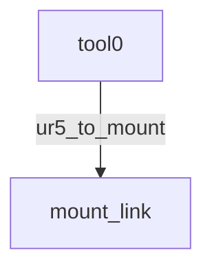

# UR5 真实 CAD Mount 末端

`urdf/ur5_umi_real.urdf` 保留 UR5 原有六轴结构，只连接当前已确认安装关系的真实 CAD mount。运行时树为：

`mount-partstudio.step` 中的 9 个 Part 分别导出为独立 STL，并保留 STEP 的 Part Studio 全局顶点坐标；静止零位不设置单独 visual origin，也不对网格重新居中或配准。STEP 坐标从毫米乘以 `0.001` 转成米。URDF 将固定实体放入 `mount_link` 和 `fixed_mount_link`，两个 holder 则分别放入独立的 jaw link。

| STEP Part | 网格 | STEP RGB | 三角面 |
|---|---|---|---:|
| `Part 1` | `meshes/part_1.stl` | `0.216, 0.216, 0.216` | 36,472 |
| `Part 2` | `meshes/part_2.stl` | `0.527, 0.527, 0.527` | 7,846 |
| `Part 3` | `meshes/part_3.stl` | `0.527, 0.527, 0.527` | 3,636 |
| `Part 4` | `meshes/part_4.stl` | `0.527, 0.527, 0.527` | 3,636 |
| `Part 5` | `meshes/part_5.stl` | `0.527, 0.527, 0.527` | 2,428 |
| `Part 6` | `meshes/part_6.stl` | `0.527, 0.527, 0.527` | 2,428 |
| `finger_holder_right` | `meshes/finger_holder_right.stl` | `0.212, 0.212, 0.212` | 5,248 |
| `finger_holder_left` | `meshes/finger_holder_left.stl` | `0.212, 0.212, 0.212` | 5,248 |
| `gripper_mount` | `meshes/mount.stl` | `0.956, 0.468, 0.000` | 7,896 |

导出网格使用 `0.01 mm` 线性偏差和 `0.15 rad` 角度偏差；仅移除 9 个零面积退化三角面，不改变有效表面。URDF visual 使用 STEP 产品级 RGB 颜色；标准 URDF 材质不能表达 STEP 中的逐面颜色覆盖。`mount_link` 的 collision 仍只使用 `meshes/mount.stl`。

## Holder 与 soft finger

`left-holder-finger-assembly.step` 和 `right-holder-finger-assembly.step` 定义了两侧 holder 与 soft finger 的相对位姿。finger 网格以对应 Assembly 产品局部坐标为原点：右侧由 `cad-input/phase3c1/umi-single-finger.stl` 毫米转米；左侧再关于产品局部 `x=0` 镜像并反转三角面绕序。原始 CAD 输入保持不变。

| 侧 | STEP holder → finger translation (m) | URDF RPY (rad) |
|---|---|---|
| left | `0.0008625831240207, -0.101421295298399, -0.0093` | `-1.5707963267948966, 0, 0` |
| right | `-0.000862583124020702, -0.101421295298399, -0.0093` | `-1.5707963267948966, 0, 0` |

两个 prismatic joint 在 `x` 轴上分别向外运动，`q=0` 对应 Assembly STEP 的静止装配位姿；行程上限为每指 `55 mm`。该 joint 位置范围对应 WSG 50 用户手册列出的每指行程。[WSG 50 用户手册](https://weiss-robotics.com/servo-electric/wsg-series/product/wsg-serie/?cid=11014&file=files%2Fdownloads%2Fwsg%2Fum_wsg50_en.pdf)

固定变换为 `xyz=[0,0,0] m`、`rpy=[-π/2,0,π] rad`，即在原安装姿态上绕法兰轴旋转 `180°`，用于将整个 Part Studio 坐标系连接到 UR5 `tool0`。

`left_finger.stl`、`right_finger.stl` 不属于 mount Part Studio 的 9 个 Part；它们分别随 `left_jaw_link`、`right_jaw_link` 运动。`gopro.stl` 保留在目录中，当前 URDF 不引用它。

URDF 网格 URI 通过加载配置解析：`ur_description` 映射到 `/robot/ur_description`，`ur_umi_real` 映射到 `/robot/ur_umi_real`。
