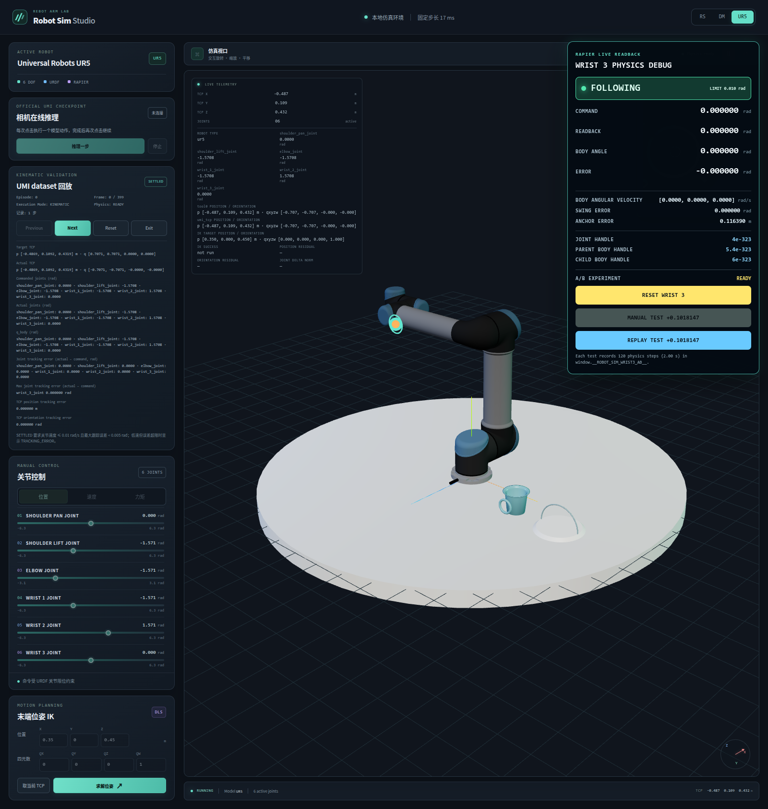

# robot-sim validation reports

This directory stores small, reproducible validation outputs that belong to robot-sim.

`phase2a-umi-episode0-frames0-99.jsonl` records a dry-run of the official UMI episode 0 TCP poses against the current UR5 `umi_tcp` kinematics. It contains one run record, one record per frame, adjacent-frame continuity checks, and a summary. Its start-pose alignment is synthetic and does not calibrate the tag frame to a physical UR5 base.

`phase2b1-umi-episode0-frames0-399.jsonl` extends the same single-alignment, sequential-seed dry-run to the first 400 frames. It keeps the Phase 2A report as the frame 0/65/99 regression baseline and adds TCP workspace bounds, per-joint ranges and joint-limit margins.

`phase2b23-wrist3-positive-stop.md` records the Phase 2B-2.3 frame 0 wrist_3 positive-direction diagnostic. The motor command was repeatedly applied, but actual readback returned toward zero and body/FK pose comparison showed a transient mismatch; remaining direction, isolation, and solver tests were stopped at that gate.

`phase2b24-wrist3-motor-target-and-body-angle.md` records the direct Rapier motor setter inputs and an independent wrist_3 angle from both rigid body world rotations and Rapier joint frames. `phase2b24-wrist3-motor-trace.jsonl` contains every wrist_3 motor write in the 20-second experiment plus its ten timepoint samples.

`phase2c1-umi-episode0-frame0.json` records one browser run of episode 0 frame 0 through `KINEMATIC_REPLAY`. It contains the Phase 2B-1 aligned target and IK solution, six joint commands/readbacks/`q_body` values, and TCP errors. The run settled at frame 0 and did not advance further.

