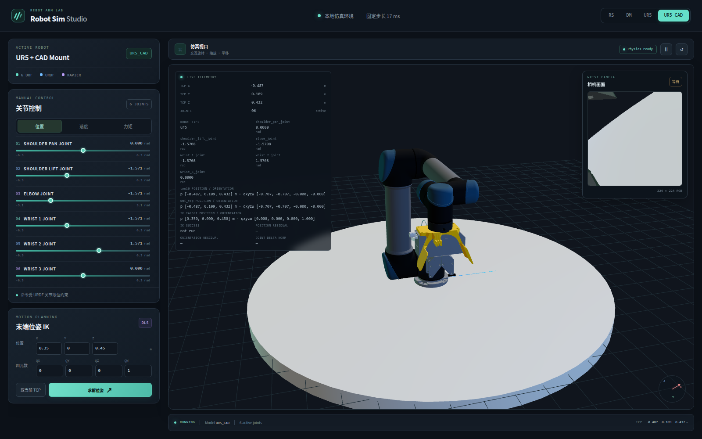
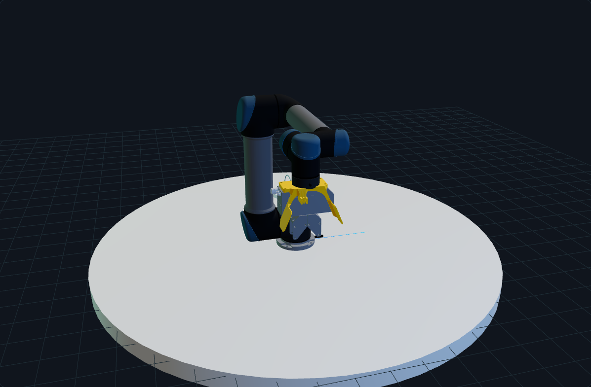
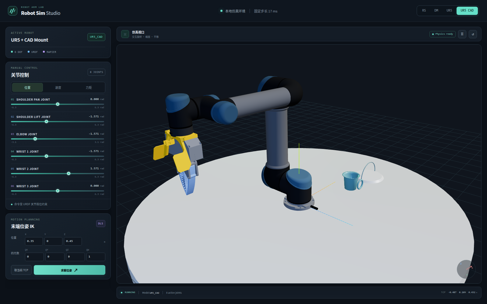
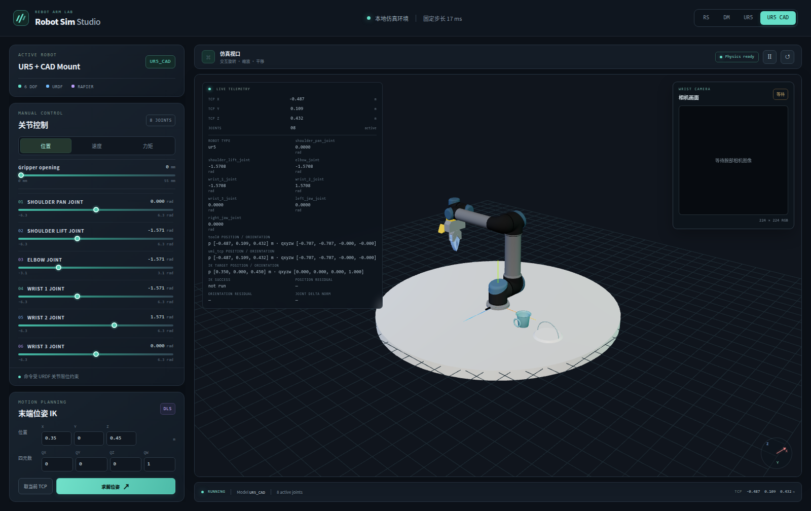

# 浏览器截图

使用 Playwright Chromium 本地检查 RS、DM 模型加载与关节控制后保存。

## Phase 3C-1：完整 `wsg50_mount`

Playwright Chromium 浏览器中选择 `UR5 + CAD Mount`，确认 Part Studio 的 9 个 STL 均加载后保存。全局视图显示 UR5 与 mount 的安装位置；末端视图隐藏页面浮层以便查看 mount 外形。

左右 soft finger 按 holder-finger Assembly STEP 的实测局部位姿安装，浏览器中分别拖动 jaw 滑块确认独立运动。

## Gripper 开合滑条

Playwright Chromium 中依次测试 0、27、55、0 mm；端点截图展示统一滑条的最小和最大值。

UR5 episode 0 的 frame 0 浏览器实测截图。实际关节状态稳定后仍偏离预计算关节目标，TCP 位置误差约 0.059 m；因此回放停在早期诊断阶段，没有生成 frame 50 和 frame 99 截图。

Phase 2B-2.3 诊断 harness 下的 UR5 q0 视图；方向测试失败后已复位到 q0。

Phase 2B-2.4 中 wrist_3 的 motor setter 持续收到 `+0.101815 rad`；20 秒后关节读回接近零。

