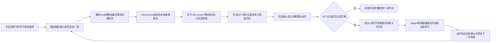

# UMI 坐标、旋转与杯子抓放流程审计

审计日期：2026-10-03

范围：`robot-sim` 浏览器仿真、在线 UMI worker、当前加载的 `cup_wild_vit_l_1img.ckpt`，以及仓库内官方 UMI 数据处理和实机回放实现。本文只读检查代码、配置和已有失败报文，没有修改运行逻辑。

## 审计结论

| 项目 | 结论 | 对本次 `IK_NOT_CONVERGED` 的关系 |
|---|---|---|
| ROS 与 Three.js 坐标轴 | 没发现动作在 FK、策略输入、IK 之间被重复旋转或漏旋转。ROS 到 Three.js 的旋转用于场景物理/显示。 | 不像是本次目标数值错误的原因。 |
| 位置和旋转单位 | 动作平移、位姿位置、夹爪宽度按米；旋转向量、关节角按弧度。报错样例的数值换算吻合。 | 可排除本样例中毫米/米、度/弧度错换。 |
| 旋转表示 | 输入四元数用 `[x,y,z,w]`；策略姿态用 rotation 6D/矩阵；动作接口使用轴角旋转向量。当前转换次序一致。 | 目标姿态复算吻合，姿态残差也在容差内。 |
| absolute / relative | 当前检查点 `action_pose_repr=relative`。每个动作相对同一个观测时刻的末端位姿；不是相对上一个预测动作的增量。 | Python 与浏览器组合次序一致。 |
| 时间戳 | 仿真帧内部有时间戳，但 WebSocket 观测不传时间戳，也不做图像、末端状态插值对齐。 | 是训练/运行时序差异，不能直接解释播放前发生的 IK 残差。 |
| TCP / 末端原点 | 仿真把 `gripper_end` 作为末端位姿；UMI 数据/实机流程另有 TCP 偏移。两者是否是同一刚体参考点尚未校准。 | 可能影响策略目标对指尖/杯子的语义，但现有证据不能证明它造成了本次 IK 停滞。 |
| 视觉识别 | 没有单独杯子检测器。策略从相机图像直接预测动作；仿真推理时还用杯子的仿真坐标自动转动相机。 | 失败报文本身不能证明看见或识别了杯子；日志没有保存模型输入图像。 |

## 本次失败数据复核

报错里的位置目标等于起始位置加动作平移：

```text
start  = [0.302889186993, 0.000000347445, 0.241307393274] m
delta  = [-0.001158354338, 0.001723800553, -0.023270936683] m
target = [0.301730832655, 0.001724147998, 0.218036456591] m
```

起始四元数接近单位四元数，所以这条样例的位置组合就是 `start + delta`。动作旋转向量 `[0.01719105, -0.02338771, 0.01371330] rad` 转成 XYZW 四元数后，与报错中的目标四元数 `[0.00859516, -0.01169335, 0.00685636, 0.99987118]` 一致。数值核对表明：动作被解析成米和弧度，轴角也按预期转成四元数。

IK 的位置残差为 `0.0060155 m`，比 `0.005 m` 容差大约多 `1.02 mm`；姿态残差为 `0.0017429 rad`，小于 `0.01 rad` 容差。迭代在第 15 次以 `no_joint_motion` 结束，并把 `joint2`、`joint3` 列为受阻关节。因而**直接失败点是 IK 在收到数值正确的目标后没有继续减小位置误差**。应继续排查初值接近关节限位、目标可达性和求解器步长/雅可比；本次审计没有证明哪一项单独是根因。

这也解释了为什么预测轨迹可以有数十毫米位移、但 IK 报错残差只有约 6 mm：前者是模型目标与起始位姿的距离，后者是 IK 当前解与第 9 个目标之间剩余的误差，二者不是同一量。

## 坐标系、位姿与动作含义

### 坐标轴

仿真使用绕 ROS X 轴 `-90°` 的变换把机器人姿态放进 Three.js 场景；对位置向量等价于 `(x, y, z) -> (x, z, -y)`。URDF 可视模型也使用相同根旋转。FK、策略末端状态、IK 目标仍使用 URDF/ROS 侧的位姿；转换出现在场景刚体更新处，没有看到策略动作再经过一次 Three.js 轴变换的代码路径。

这只证明代码里的轴向处理互相吻合，不代表训练机械臂基座、仿真基座和桌面安装位姿已经做过实物标定。可核对 [RobotBody.tsx](src/sim/RobotBody.tsx#L57) 的场景变换、[URDFViewer.tsx](src/viz/URDFViewer.tsx#L49) 的模型根旋转，以及 [RobotModel.ts](src/core/RobotModel.ts#L64) 的 FK 末端位姿来源。

### 位姿转换与 relative 语义

当前检查点从 `payload['cfg']` 读取到 `obs_pose_repr=relative`、`action_pose_repr=relative`、图像历史长度 1、本体状态历史长度 2、动作长度 16。服务固定加载 [cup_wild_vit_l_1img.ckpt](server/load_model.py#L15)，worker 从该检查点读取有效配置；YAML 默认值不能替代 checkpoint 配置。

官方实现把旋转向量转为矩阵，并按 `T_relative = inverse(T_base) * T_pose` 编码；解码时按 `T_target = T_base * T_relative`。浏览器用同一规则组合位置和四元数：`targetPose = composePoses(startPose, deltaPose)`。见 [pose_repr_util.py](../universal_manipulation_interface/diffusion_policy/common/pose_repr_util.py#L62)、[real_inference_util.py](../universal_manipulation_interface/umi/real_world/real_inference_util.py#L173) 与 [math.ts](src/utils/math.ts#L111)。

这里的 `relative` 表示相对于**本次观测的当前末端姿态**。一个 16 步动作块里的每个目标都相对同一个 `startPose` 解码，求 IK 时只把上一个已求出的关节解用作下一步 seed；它不是把 16 个小增量逐个累加。动作项 `[dx,dy,dz,rx,ry,rz,width]` 的前三项是米，中间三项是弧度轴角，最后一项是米制夹爪宽度，见 [umiIk.worker.ts](src/workers/umiIk.worker.ts#L77) 和 [useInferenceReplay.ts](src/app/useInferenceReplay.ts#L200)。

模型内部姿态是 10 维 `[xyz, rotation6d]`。Python 将 rotation 6D 还原为矩阵，再转轴角；前端把轴角转 XYZW 四元数。官方矩阵/6D 代码见 [pose_util.py](../universal_manipulation_interface/umi/common/pose_util.py#L86)，前端转换见 [umi_sim_replay_worker.py](../universal_manipulation_interface/scripts/umi_sim_replay_worker.py#L146) 和 [umiIk.worker.ts](src/workers/umiIk.worker.ts#L78)。本次目标四元数复算一致，未发现旋转分量次序或角度单位错误。

服务发给前端的动作块目前不带 `action_pose_repr` 字段，浏览器按 relative 组合。当前检查点确认为 `relative`，所以当前链路是匹配的；如果以后换成 absolute 或 delta 检查点，协议可能静默误解动作，见 [inference_protocol.py](server/inference_protocol.py#L57)。

### TCP 原点与夹爪尺度

仿真 URDF 有左右手指两个末端叶节点；解析器将它们的共同父节点 `gripper_end` 选作 `tipLink`，然后用该 link 的 FK 作为策略末端位姿和 IK 末端目标。URDF 中 `gripper_end` 从 `link6` 经固定关节偏移 `0.16621 m`，见 [urdfParser.ts](src/utils/urdfParser.ts#L195) 和 [ReBot_Arm_RS.urdf](../reBotArmController_ROS2/src/rebotarm_bringup/description/RS/urdf/ReBot_Arm_RS.urdf#L603)。

UMI 数据生成脚本给相机到 TCP 的构造加入 `tcp_offset=0.205 m` 默认偏移；官方 UR5 RTDE 环境默认又是 `0.13 m`。这些偏移描述的设备、安装点和局部轴不同，不能直接用数字相减推定实际误差。但当前仿真没有显式的 `gripper_end -> 训练 TCP` 固定变换，所以要用训练时实际工具几何与 ReBot 指尖测量值核实这一关系。若不一致，它可能改变图像/本体状态所表达的抓取点，以及旋转时 TCP 的弧线位置；它不是本次米/弧度转换算错的证据。见 [数据生成脚本](../universal_manipulation_interface/scripts_slam_pipeline/06_generate_dataset_plan.py#L100) 和 [UMI 实机环境](../universal_manipulation_interface/umi/real_world/umi_env.py#L55)。

RS 两个手指 URDF 行程合计 `0.1215 m`，官方单臂评估默认夹爪最大宽度为 `0.09 m`。仿真按两个 prismatic 关节行程比例分配模型宽度，并以两侧位移之和作为观测宽度；当前失败动作的夹爪宽度 `0.08247 m` 仍落在官方默认范围内。夹爪最大开口几何有差异，但它不参与本次 IK 位置残差；IK 成功后才设置夹爪关节目标。见 [RS URDF](../reBotArmController_ROS2/src/rebotarm_bringup/description/RS/urdf/ReBot_Arm_RS.urdf#L676)、[IK Worker](src/workers/umiIk.worker.ts#L122) 和 [官方评估默认值](../universal_manipulation_interface/scripts_real/eval_real_umi.py#L104)。

## 时间戳与采样节奏

本地腕部相机每 `50 ms` 采集一帧 `224×224` RGB，并在帧对象里记录 `performance.now()`。应用发送最新一张图片和最近两帧的末端位置、轴角及夹爪宽度；WebSocket 消息只传 `frame_index`，没有传帧时间戳。见 [WristCameraCapture.tsx](src/sim/sensors/WristCameraCapture.tsx#L29) 与 [App.tsx](src/app/App.tsx#L141)。机械臂仿真状态最多每 `100 ms` 发布一次，因此间隔 `50 ms` 的两条 proprio 记录有可能重复同一状态。代码没有用时间戳插值来校正这种状态更新节奏，见 [RobotBody.tsx](src/sim/RobotBody.tsx#L611)。

官方实机流程会读取相机采集时间，再把机器人 TCP 与夹爪状态插值到相机时间轴；例如 [replay_real_robot.py](../universal_manipulation_interface/scripts/replay_real_robot.py#L37) 与 [umi_env.py](../universal_manipulation_interface/diffusion_policy/real_world/umi_env.py#L263)。因此当前仿真缺少的是显式对时/延迟补偿，不是帧序号完全错乱的证据。

检查点中的 `dataset_frequeny` 为 `0`，任务 [YAML 配置](../universal_manipulation_interface/diffusion_policy/config/task/umi.yaml#L6) 中的延迟步数通过 `(camera_obs_latency - robot_obs_latency) * dataset_frequeny` 计算，因此该配置不会形成有效的延迟步校正。对本地 [cup_in_the_wild.zarr.zip](../universal_manipulation_interface/data/cup_in_the_wild.zarr.zip) 的 Zarr 元数据检查发现，`data` 组含图像、末端位置/旋转、夹爪宽度和演示起止位姿；`meta` 组有 `episode_ends`，但归档中没有 timestamp 或 fps 字段。YAML 在 `dataset_frequeny` 旁注释了 `59.94`；若按该注释和 `down_sample_steps=3` 估算，动作点间隔约 `50.05 ms`，但这只是配置注释推导值，不是该归档内的时间戳实测值。

当前浏览器对每个预测目标插值播放 `0.5 s`，16 个点约需 8 秒；官方在线评估默认控制频率为 `10 Hz`，并用观测时间戳排程动作。因有效 checkpoint 数据频率为 0，不能断言 50 ms 就是该模型唯一正确的动作周期，但仿真 500 ms/点与官方排程机制明显不同。播放速度会影响下一次观测和物理抓放效果；它不会导致这次失败，因为仿真在播放前先对整块 16 个目标做 IK。见 [SceneManager.tsx](src/viz/SceneManager.tsx#L35) 和 [eval_real_umi.py](../universal_manipulation_interface/scripts_real/eval_real_umi.py#L86)。

## 从杯子图像到抓取并放到碟子的执行流程



1. **采图。** 摄像机挂在 `tipLink` 上。推理进行期间，仿真直接读取 `cupBodyRef` 的杯子世界坐标，把相机朝向杯子中心附近；相机再渲染场景并上下翻转像素行。杯子坐标只用于仿真相机瞄准，不作为额外目标坐标发给策略，见 [WristCameraCapture.tsx](src/sim/sensors/WristCameraCapture.tsx#L75)。
2. **构造观测。** 前端从图像帧中取最新 RGB，并附上最近两帧末端位置、轴角和夹爪宽度，Base64 编码后连同 `frame_index` 发送。首帧不足两帧时会复制首帧填满历史长度。此处没有发送时间戳，也没有杯子框或物体类别。
3. **视觉策略推理。** 后端启动官方 UMI worker，读取 `camera0_rgb` 和本体状态数组；worker 把 RGB 解码成 `uint8`，构造图像长度 1 和本体长度 2 的 observation，再调用 checkpoint 的 `predict_action`。这是图像到动作的策略推理，不是“先检测杯子、再调用抓取规划器”的流程。当前预测日志保存动作和轨迹摘要，不保存输入图像，因此仅凭错误日志无法验证模型是否正确看见杯子。
4. **动作转换。** 检查点输出 16 个 10 维目标，每个目标包含位置、rotation 6D 和夹爪宽度。Python 将 rotation 6D 转成旋转矩阵和轴角，把 10 维结果整理为前端使用的 7 维动作；动作表示标签在当前 worker 输出中是 `relative`。
5. **整块预求解 IK。** 浏览器把每个相对动作都合成到观测时的 `startPose`，用当前关节值作为首个 seed，之后用上一个目标的解作为下一个 seed。**只有 16 个目标全部收敛，前端才设置播放动作块。** 报错里的 `episode_index=0, frame_index=1, action_index=8` 表示第二个观测产生的动作块在第 9 个目标失败；这整个 frame 1 动作块没有进入播放阶段。
6. **物理回放。** 若整块 IK 成功，`SceneManager` 每个目标用平滑曲线插值 `0.5 s`，逐步更新关节位置目标。杯子是有质量的动态刚体，碟子是固定刚体；机器人夹爪与杯子靠碰撞接触产生运动，见 [CupArrangementScene.tsx](src/sim/tasks/CupArrangementScene.tsx#L32)。策略希望通过张开夹爪、靠近/闭合、抬起、移动至碟子上方、放开等动作完成任务，但代码没有把这些步骤编码成抓放状态机。
7. **确认并再次观测。** 动作块回放完成后，前端向服务确认，服务再等下一条观测。终端已出现 `frame_index=1`，说明 frame 0 动作块此前已走到后续观测阶段；这能说明前一块执行流程继续了，不能说明杯子确实被夹起或落在碟子里。当前没有抓取约束、杯子位姿成功判定或放置成功检查；应以仿真中杯子是否离桌、是否随夹爪移动、最后是否稳定落在碟面为准。

## 对“是否识别出杯子”的判定边界

在线策略接收的是图像和末端状态，不接收显式的杯子检测框、杯子姿态或类别结果。仿真利用杯子真值坐标让相机看向杯子，这提高了杯子进入视野的机会，但没有证明策略内部正确识别了杯子。现有 `inference-predictions.jsonl` 记录预测动作，不含对应 RGB；因此无法只靠目前的失败 JSON 回看这一帧的杯子清晰度、遮挡和模型视觉判断。

若要验证识别错误，需要为同一 `frame_index` 保存实际送入 worker 的 224×224 RGB，并并排查看场景截图和策略动作。那属于后续观测取证；本报告不修改采集或日志代码。

## 审计边界

本报告验证的是实现路径和失败样例的数学一致性，没有在浏览器重新执行该帧，没有对该目标尝试不同关节 seed，也没有以图像判断杯子识别结果。Zarr 压缩图像使用 `imagecodecs_jpegxl`，当前 `umi` 环境缺少该 codec，因此本次只检查了 Zarr 元数据和数组名，没有解码数据集图像。已确认的直接现象是 IK 在位置残差约 6 mm 时停住，旋转误差仍低于容差；TCP 原点、同步和视觉差异是待校准/取证项，不应与已经复算通过的坐标、单位和旋转转换混为一谈。
