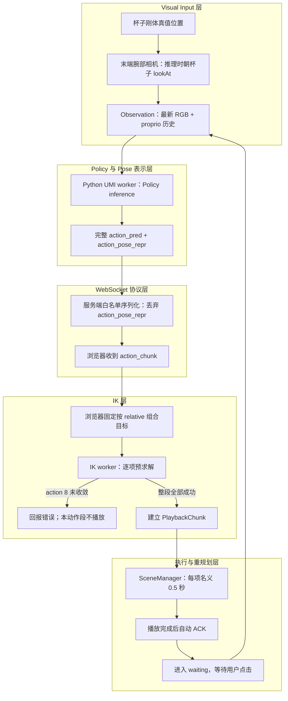

# UMI / robot-sim 系统调试统一审计与整改报告

> 审计日期：2026-10-03
> 输入材料：robot-sim/question_find.md、robot-sim/umi_system_debug_audit_v2.md
> 审计范围：UMI Policy 输出、动作表示与 WebSocket 协议、浏览器 IK、动作预求解与播放、相机输入、TCP / Camera Extrinsic、数据与 Checkpoint 配置
> 证据原则：以当前工作区源码、日志和用户提供的故障记录交叉核对。下文明确区分源码事实、运行记录和未验证推断。

## 1. Executive Summary

- **失败位置：** 用户提供的记录显示，frame_index=1 / action_index=8 在浏览器 IK 预求解阶段以 no_joint_motion 停止。位置 Residual 为 6.0155 mm，高于 5 mm 容差；姿态 Residual 为 0.0017429 rad，低于 0.01 rad 容差。
- **当前直接机制：** 位置误差未达到收敛阈值，IK 求解器没有产生达到更新阈值的关节变化，因此第 9 个目标未收敛。IK worker 只有在整段目标全部求解成功后才返回 solved，所以本次动作段没有开始播放。
- **尚未确认的根因：** action 8 的完整 world target、求解输入 Seed、逐轮关节变化和 Residual 都没有保存在当前日志中。Seed 敏感、局部停滞、Joint Limit 影响和目标在所有合法关节状态下不可达，均未被现有证据裁决。
- **已排除的直接原因：** 当前运行记录为 relative，且 UMI 与浏览器该表示的公式匹配；姿态误差没有超限；前 8 个 IK 解没有实际播放；播放时长发生在 IK 预求解之后。
- **独立系统问题：** action_pose_repr 在服务端序列化动作块时被丢弃，浏览器固定按 relative 解码。当前样本恰好使用 relative，所以该协议缺陷不是本次失败原因。当前系统还把整段预求解、回放和人工触发下一次 Observation 串成较长的分段闭环。
- **最高信息增益的下一步：** 先保存本次失败的完整输入、Seed 和 solver trace，再对同一 target 做多 Seed 重放。当前故障数值来自用户提供的记录；本轮未在代码、日志或仿真中重放失败。

## 2. System Architecture and Control Loop



链路分为五层：

1. **Visual Input：** 浏览器仿真相机采集 RGB，Observation 同时带末端位置、旋转和夹爪宽度历史。推理采帧期间，相机朝杯子刚体位置转向。
2. **Policy：** Python worker 根据 Observation 调用 UMI Policy，生成完整预测序列；本次预测记录有 16 项。
3. **Pose Conversion / Protocol：** worker 把动作表示标签与动作一起输出；服务端序列化时只保留动作数组和索引字段，标签未传给浏览器。
4. **IK：** 浏览器把每项动作都相对于请求中的同一个 startPose 组成目标；每项成功后更新下一项的 IK Seed。
5. **Execution / Replanning：** 只有整段 IK 成功才建立 PlaybackChunk。播放结束后程序自动发送 ACK；之后需用户点击“推理一步”才发送下一 Observation。

证据：Observation 构造见 robot-sim/src/app/App.tsx:141-159；Python worker 输出见 universal_manipulation_interface/scripts/umi_sim_replay_worker.py:146-161；序列化见 robot-sim/server/inference_protocol.py:57-64；IK 与播放启动见 robot-sim/src/workers/umiIk.worker.ts:56-60,77-91,92-119,141-144、robot-sim/src/app/useInferenceReplay.ts:241-275；自动 ACK 和后续等待见 robot-sim/src/app/useInferenceReplay.ts:547-570。

## 3. Current Failure Case

| 字段 | 本次记录 | 证据与边界 |
|---|---|---|
| episode / frame / action | episode 0；frame 1；action 8 | 预测日志有 episode 与 frame；故障 action 索引来自用户提供的故障记录。索引从 0 开始，所以 action 8 是第 9 项。 |
| action 表示 | relative | robot-sim/server/logs/inference-predictions.jsonl:42 记录了表示标签。 |
| 动作数 | 16 项 | 同一预测日志行记录 16 项；这表示本次长度，不证明所有 Checkpoint 或所有 chunk 永远固定为 16。 |
| action 8 相对平移 | [-0.0011583543, 0.0017238006, -0.0232709367] m | 来自预测日志；这是 Policy 相对动作分量，不是 IK Residual。 |
| target displacement | 23.3634 mm | 当前末端到 action 8 目标点的直线位移，来自预测日志的 trajectory_summary。 |
| cumulative path | 24.4122 mm | 从当前末端起沿预测目标序列逐点累加，到 action 8 的路径长度；来自同一日志。 |
| position Residual | 6.0155 mm | 用户提供的故障记录；比 5 mm 容差多 1.0155 mm。当前项目未持久化该次完整浏览器错误对象。 |
| orientation Residual | 0.0017429 rad | 用户提供的故障记录；小于 0.01 rad 容差。 |
| solver 停止信息 | no_joint_motion；报告 blocked joints 为 joint2 / joint3 | 来自用户提供的故障记录。源码只定义这些字段的含义，不能复原当时逐轮状态。 |
| 已播放情况 | 当前动作段尚未开始播放 | worker 在 action 8 未收敛时立即返回 error；播放只在整段 solved 后建立。 |
| world target / startPose / 输入 Seed | 未持久化 | 预测日志只保留预测、表示标签和位移摘要；CSV 没有帧号或动作号。不能用旧报告中的坐标代替本次精确输入。 |

四个距离量不可混用：

- **target_displacement：** 当前末端到单个 Policy 目标位置的直线距离。
- **cumulative_path：** 当前末端经由前序目标到某个预测目标的折线路径长度。
- **position_residual：** 当前 IK 关节值经 FK 得到的末端位置，与固定 IK target 之间的欧氏距离。
- **orientation_residual：** 当前 FK 姿态与固定 IK target 之间的旋转误差模长。

因此，action 8 的 23.3634 mm 位移、24.4122 mm 累计路径和 6.0155 mm IK position Residual 各有不同定义。前两项来自预测日志；Residual 来自故障记录。

## 4. Confirmed Facts

- 当前策略已经产生动作序列；本次预测记录中包含 frame 1、16 个动作和 action_pose_repr=relative。证据：robot-sim/server/logs/inference-predictions.jsonl:42。
- Python worker 将完整预测序列转为 action chunk 输出，没有在该处截短到较短执行窗口。证据：universal_manipulation_interface/scripts/umi_sim_replay_worker.py:146-161。
- 浏览器 IK worker 逐项预求解动作；失败时立即返回，只有完整动作数组全部成功才发送 solved。证据：robot-sim/src/workers/umiIk.worker.ts:56-60,92-119,141-144。
- 当前 IK 参数为最多 100 次迭代、固定 damping 0.05、position tolerance 0.005 m、orientation tolerance 0.01 rad、max angular step 0.15 rad、max linear step 0.01 m。证据：robot-sim/src/workers/umiIk.worker.ts:13-20。
- solver 的成功条件要求位置和姿态两项误差分别达到容差。证据：robot-sim/src/core/Kinematics.ts:326-343。
- URDF 中 joint2 与 joint3 的合法范围均为 [0, 3.14] rad。证据：reBotArmController_ROS2/src/rebotarm_bringup/description/RS/urdf/ReBot_Arm_RS.urdf:193-210,307-324。
- UMI worker 的预测日志不保存 IK startPose、输入 Seed、最终 Residual 或逐轮求解历史；action CSV 仅保留最近 30 条关节记录且无 frame/action 索引。证据：robot-sim/server/prediction_log.py:10-18、robot-sim/server/logs/README.md:3-7。
- 当前仿真推理接口发送一张 224×224 RGB 图像与最多两条 proprio 记录；只有一条 proprio 记录时会重复该记录。Python worker 将 RGB 解码为 224×224×3。证据：robot-sim/src/app/App.tsx:141-159、robot-sim/src/app/inferenceProtocol.ts:62-68、universal_manipulation_interface/scripts/umi_sim_replay_worker.py:58-79。
- 相机帧对象包含采集 timestamp，但 Observation 序列化只发送最新 RGB 与 proprio 数组，没有发送该 timestamp；因此当前消息不能重建图像与状态样本的精确采集时刻。证据：robot-sim/src/sim/sensors/WristCameraCapture.tsx:10-16,122-128、robot-sim/src/app/App.tsx:141-159、robot-sim/src/app/inferenceProtocol.ts:62-68。
- Repository 默认任务配置写有双帧图像历史、双帧 proprio 和 16 项 action horizon；这是模板值，不能替代当前 Checkpoint 内实际保存的 cfg。证据：universal_manipulation_interface/diffusion_policy/config/task/umi.yaml:9-20,78-90。

上述失败 Residual、停止原因和 blocked joints 是用户提供的故障记录，不是当前服务端日志独立重建出的运行轨迹。

## 5. Confirmed Bugs

### action_pose_repr 在服务端序列化时丢失

已确认的数据路径是：

1. Python worker 从 Checkpoint 配置读取 action_pose_repr，并把标签连同动作写入输出。证据：universal_manipulation_interface/scripts/umi_sim_replay_worker.py:48-50,146-159。
2. 服务端预测日志也保留该标签。证据：robot-sim/server/prediction_log.py:10-18。
3. 服务端 serialize_action_chunk 只序列化 episode、frame、last_chunk 和 actions，没有序列化 action_pose_repr。证据：robot-sim/server/inference_protocol.py:57-64。
4. 前端 ActionChunk 与 IK 请求类型均不含该字段；IK worker 固定调用 composePoses(startPose, deltaPose)。证据：robot-sim/src/app/inferenceProtocol.ts:3-9,37-43、robot-sim/src/workers/umiIk.worker.ts:77-91。

这是真实的协议缺陷。当前日志表示为 relative，而浏览器当前组合公式与 relative 一致，因此该缺陷没有造成本次 action 8 失败。若将来 Checkpoint 输出 legacy rel、abs 或 delta，浏览器缺少表示标签就可能使用错误解码语义。修复时应让表示字段端到端保留，并按对应表示解码。

## 6. Ruled Out for Current Failure

- **当前 relative 的左右乘或旋转顺序不匹配：RULED OUT。** UMI 对 relative 的解码是 T_target = T_base × T_rel；浏览器对位置使用 p_base + R_base × p_rel，对姿态使用 q_base × q_rel。预测日志的表示也是 relative。证据：universal_manipulation_interface/diffusion_policy/common/pose_repr_util.py:62-64,94-96、robot-sim/src/utils/math.ts:111-114、robot-sim/server/logs/inference-predictions.jsonl:42。
- **orientation tolerance 导致本次失败：RULED OUT。** 故障记录中的 0.0017429 rad 小于 worker 的 0.01 rad 阈值；超阈值的是 position Residual。证据：robot-sim/src/workers/umiIk.worker.ts:13-20。
- **action 0 至 action 7 已经在本动作段中播放：RULED OUT。** IK worker 必须在所有动作成功后才发 solved；播放状态只在 solved 回调中创建。证据：robot-sim/src/workers/umiIk.worker.ts:92-119,141-144、robot-sim/src/app/useInferenceReplay.ts:241-275。
- **0.5 秒播放时长直接造成本次 IK 停止：RULED OUT。** action 8 在 playback 建立前已经失败，播放时钟还没有开始。证据：robot-sim/src/viz/SceneManager.tsx:35-36,57-90。
- **camera.lookAt(cup) 直接改变已交给 solver 的 IK 方程：RULED OUT。** 相机可通过 Policy Input 影响先前生成的动作目标；目标一旦给定，IK 使用该 target 与 Seed 求解。它不能解释求解器针对固定 target 为什么停止更新。

UMI 的两种表示不能混称：

- **relative：** 编码为 T_rel = inverse(T_base) × T_pose；解码为 T_target = T_base × T_rel。因此 p_target = p_base + R_base × p_rel，R_target = R_base × R_rel。当前浏览器的 composePoses 与这组解码公式等价。
- **rel：** legacy 编码为 p_rel = p_pose - p_base、R_rel = R_pose × inverse(R_base)；解码为 p_target = p_base + p_rel、R_target = R_rel × R_base。它的平移不旋转到 base 局部坐标，旋转乘法次序也不同。

公式依据：universal_manipulation_interface/diffusion_policy/common/pose_repr_util.py:53-64,85-96；robot-sim/src/utils/math.ts:111-114。当前运行标签是 relative，因此相对位姿公式不匹配已 RULED OUT；协议丢字段仍会让未来的 rel 或其他表示被错误解释。

以上裁决只针对本次失败的直接机制。视觉输入、协议表示、整段拒绝和重规划节奏仍是系统问题。

## 7. IK Solver Audit

### 实际求解流程

Kinematics.solveIK 使用阻尼最小二乘与 Joint Limit active-set 处理，概要如下：

```text
q = 将输入 Seed 夹到合法关节范围
pose = FK(q)
residual = target 与 pose 的位置、姿态误差

while 尚有迭代次数且 residual 未同时满足两项容差：
  error = 位置误差与姿态误差向量
  J = 当前关节到 tip 的 Jacobian
  解 (J × Jᵀ + damping² × I) × y = error
  deltaQ = Jᵀ × y
  对位于限位且本轮提议方向朝外的关节：
    从 active set 移除该关节
    以其余关节重算 deltaQ
  限制每个关节的单步幅度
  将 q + deltaQ 夹到各自关节限制范围
  若所有可动路径关节的变化都小于 1e-10：
    以 no_joint_motion 退出
  否则接受新 q，重新计算 FK 和 residual

返回最终关节值、收敛标志、迭代数、Residual、退出原因和累计 blockedJoints
```

关键实现见 robot-sim/src/core/Kinematics.ts:154-237。worker 的实际参数见 robot-sim/src/workers/umiIk.worker.ts:13-20。

### 源码事实与本次运行未知项

- **源码事实：** 每次有非零更新时，solver 会接受新关节值并重算 Residual；它不比较更新前后的 Residual 是否下降。实现没有 best-state tracking、rollback、line search 或 adaptive damping。Damping 固定为 0.05。
- **源码事实：** 到达 Joint Limit 且本轮步长指向边界外的关节会从当前 active set 移除，并用剩余变量重算。各轴的步长之后会限制并 clamp。
- **源码事实：** no_joint_motion 表示单步限制和关节 clamp 之后，所有路径关节的实际变化均小于 1e-10。若没有足够变化，代码直接退出；不会用一次新 FK 重算来更新最终 Residual。
- **源码事实：** blockedJoints 是求解过程中累计的名称集合。某个关节曾在某次迭代触限，不表示它一定在最终触发 no_joint_motion 的迭代中受阻。
- **运行未知：** 本次没有逐轮 q、deltaQ、active set、clamp 标记或 Residual，因此无法判断求解中是否真的出现 Residual 恶化、更新方向受限或局部停滞。

实现允许残差变差的步长被继续接受，这是 solver 设计风险；当前证据不能证明本次失败实际发生了残差恶化。没有逐轮 trace 前，不能据此定根因。

## 8. Failed Target / Joint Limit Analysis

| 判断 | 状态 | 证据与限制 |
|---|---|---|
| joint2 / joint3 的 URDF 下限为 0 rad | CONFIRMED | 两轴范围均为 [0, 3.14] rad；见 ReBot_Arm_RS.urdf:193-210,307-324。 |
| 当前最后一条 CSV 中 joint2 / joint3 为 0 | CONFIRMED | step 132 的两轴值为 0；见 robot-sim/server/logs/inference-actions.csv:31。CSV 无 frame/action 索引。 |
| step 132 就是 action 8 的完整失败 Seed | LIKELY | 失败路径会把错误中的 joint values 回传并记录；行序相关，但 CSV 不标记 frame/action。见 robot-sim/src/app/useInferenceReplay.ts:115-138、robot-sim/server/inference.py:108-121、robot-sim/server/logs/README.md:3-5。 |
| Joint Limit 导致本次 no_joint_motion | POSSIBLE | 下限值与记录中的 blocked joints 相关；缺 action 8 输入 Seed、逐轮 deltaQ、active set 与 clamp 历史。 |
| action 8 target 在当前 Seed 与当前 solver 下可达 | INCONCLUSIVE | 完整 world target、startPose、Seed 与该次逐轮求解轨迹均未持久化。 |
| action 8 target 在全部合法关节范围内不可达 | INCONCLUSIVE | 没有相同 target 的多 Seed 结果或独立可达性分析。 |

joint2 / joint3 位于下限时仍可向正方向进入合法区间；CSV 中其他四轴也没有落在各自边界。故障记录中的 blocked joints 代表求解期间检测到受限方向，不等于机械臂所有自由度被锁住。no_joint_motion 不能单独证明物理上不可达。

旧稿中的 world start/target 坐标与迭代次数无法从当前持久化材料复核，故不作为本报告事实。当前可确认的是 Policy 的 relative action 分量与 23.3634 mm target displacement；world target 仍需原始 startPose 才能重建。

## 9. Prediction Horizon vs Execution Horizon

| 概念 | 含义 | 当前 robot-sim | 官方 UMI real eval |
|---|---|---|---|
| Prediction Horizon / action horizon | Policy 一次生成的未来动作范围 | 当前预测日志长度为 16；worker 发送完整序列 | 从 Checkpoint 配置读取预测序列；当前 Checkpoint 的嵌入 cfg 尚未核实 |
| Execution Horizon | 新 Observation 到来前实际播放的动作范围 | 只有全段 IK 成功后，才播放整个当前 action chunk；本次失败所以播放 0 项 | 用 action timestamp 筛选当前时间之后的动作，再把目标提交给控制器 |
| Replanning Horizon | 到下一次 Observation / Policy inference 的时间或步数 | 播放整段并自动 ACK 后，仍需人工点击下一步 | 默认 frequency=10 Hz、steps_per_inference=6；名义按 6 个时间时隙推进，约 0.6 秒后进入下一轮 |

三个概念不能互换。Repository 当前默认配置在 universal_manipulation_interface/diffusion_policy/config/task/umi.yaml:9-11 写有 action_horizon: 16；该默认值不是当前 Checkpoint 内部配置的替代证据。当前实际日志的 16 项长度见 robot-sim/server/logs/inference-predictions.jsonl:42。

官方 real eval 的 steps_per_inference=6 与 frequency=10 是时间调度参数。程序按动作时间戳选取仍在未来的目标并提交；如果推理超出时间预算，会安排最后一个目标到下一个可用时隙。因此不能简化成“每轮总是硬切恰好六条 command”。证据：universal_manipulation_interface/scripts_real/eval_real_umi.py:86-89,117,412-435,479-481。

eval_real_umi.py 中 policy.num_inference_steps=16 指 DDIM 扩散采样迭代数，不是动作 horizon。证据：universal_manipulation_interface/scripts_real/eval_real_umi.py:205-212。

## 10. Chunk Pre-solve / Rejection Architecture

### 当前行为

当前 worker 对完整 actions 数组逐项求解，并滚动更新 Seed。action 8 未收敛时会立即返回；之前的 action 0 至 action 7 只有内存中的关节解，没有进入 PlaybackChunk。全段通过时才开始播放。证据：robot-sim/src/workers/umiIk.worker.ts:50-56,77-91,92-119,122-144、robot-sim/src/app/useInferenceReplay.ts:241-275。

因此，一个动作块内较后的目标求解失败，会使同一块中较前的已求解目标也无法执行。这是已确认的 chunk 拒绝行为，不能反推 action 0 至 7 已移动过。

### Diagnostic Fix

先完整保存 action、startPose、Seed、解码目标、每项解、最终 q、Residual、blocked joints、退出原因和 IK 参数。保持失败可复现后，再判断是 Seed、求解器更新还是 Joint Limit 的问题；不要先把 position tolerance 从 5 mm 放宽来遮住停滞。

### Architecture Improvement

完成故障复现后，再把 Policy 输出范围与实际执行范围分开。保留完整预测序列作为候选，只对计划执行的短时域求解和播放，然后读取新 Observation 并重规划。如此可以减少一个较后目标失败阻止全部近期动作的范围。新方案仍需明确失败时如何处理当前短段，不能把未求解目标送入播放。

## 11. Observation and Replanning Timing

| 环节 | 当前 robot-sim | 官方 UMI real eval |
|---|---|---|
| Observation | 最新 224×224 RGB 与最多两帧 proprio；发出后等待策略返回 | 从实机相机与机器人状态取得带时间信息的观测；图像与 proprio 历史长度由加载 cfg 提供 |
| 推理频率 | 不是自动连续循环；成功播放一个 chunk 后等待人工点击 | 默认控制频率 10 Hz，按 steps_per_inference=6 推进时间轴 |
| IK / Action 调度 | 播放前预求解整段 | 对预测动作赋时间戳，按当前时间过滤未来目标并提交 |
| 单项动作时间 | 每项名义 0.5 秒；SceneManager 每帧最多累计 0.05 秒仿真进度 | 按 0.1 秒控制时隙调度；UR5 插值控制器为 500 Hz |
| 重新观察 | 16 项全段成功播放后自动 ACK，再等人工点击；播放中不自动重新推理 | 时间周期完成后获取下一观测并重新推理 |
| 当前失败影响 | action 8 在播放前失败，本段没有 0.5 秒动作播放 | 不适用 |

当前 16 项若都通过 IK，名义播放时间为 16 × 0.5 = 8 秒；实际墙钟时间可能更长，因为每帧增量被限制到 0.05 秒。这个 8 秒只描述成功播放完整 16 项的情况，不描述本次失败段。官方 real eval 用 timestamp scheduling 与较短的时间推进间隔，两者重规划节奏存在架构差异。证据：robot-sim/src/viz/SceneManager.tsx:35-36,57-90、universal_manipulation_interface/scripts_real/eval_real_umi.py:86-89,412-435,479-481、universal_manipulation_interface/umi/real_world/umi_env.py:231-244。

## 12. Camera / Visual Distribution Audit

| 属性 | 当前 robot-sim | UMI 数据与实现 | 审计判断 |
|---|---|---|---|
| 输出尺寸 | 浏览器渲染为 224×224 RGB，输入 worker 前按 224×224×3 解码 | 示例 cup_in_the_wild 的 camera0_rgb 为 224×224×3、uint8；实机输入按加载 cfg 目标尺寸处理 | 相同分辨率不代表图像分布相同 |
| 投影与镜头 | Three.js PerspectiveCamera 参数为 60°，方形 render target | 仓库 GoPro 标定样例标记 FISHEYE 并含畸变参数；real eval 可选 FisheyeRectConverter | 没有证据支持“当前 Policy 输入等于 155° Perspective”；Checkpoint 使用的实际镜头与校正选项未知 |
| 相机安装 | 挂在机器人 tipLink，局部位置 (0, 0, 0.055)，局部旋转 (0, 1.355-π/2, 0) | UMI 数据计划与实机配置依设备安装变换 | 当前 sim-to-data camera-to-TCP 外参未对齐 |
| 运行时朝向 | inferenceActive 时读取杯子刚体世界位置，把目标设为 (x, y+0.039, z)，执行 camera.lookAt；非推理时恢复固定局部旋转 | UMI 实机相机由实际安装与观测变换决定；所查代码没有依据仿真杯子真值主动转向相机的逻辑 | 相机真值引导是已确认的仿真行为；它是否降低策略表现仍需 A/B 验证 |
| 图像处理 | RenderTarget 读回后提取 RGB，并垂直翻转；该路径没有鱼眼变换、crop 或 mask | UMI 实时与离线路径可做 resize、鱼眼矫正、镜像处理、mirror crop、预定义 mask；具体选项由运行参数决定 | 只能确认仓库支持这些分支，不能推断当前 Checkpoint 使用了哪一种 |
| 数据增强 | 当前仿真采集未应用训练增强 | 仓库某些训练 workspace 配置含 RandomCrop 等增强 | 示例训练配置不代表当前 Checkpoint 的训练流水线 |

源码证据：仿真相机与读回见 robot-sim/src/sim/sensors/WristCameraCapture.tsx:29-32,61-71,86-120；实机图像处理分支见 universal_manipulation_interface/umi/real_world/umi_env.py:117-175；实时 fisheye 参数为可选项，见 universal_manipulation_interface/scripts_real/eval_real_umi.py:91-95,120-130；标定样例见 universal_manipulation_interface/example/calibration/gopro_intrinsics_2_7k.json:3-16；离线处理见 universal_manipulation_interface/scripts_slam_pipeline/07_generate_replay_buffer.py:58-66,215-235；示例 RandomCrop 配置见 universal_manipulation_interface/diffusion_policy/config/train_diffusion_unet_timm_umi_workspace.yaml:63-65。

**当前结论：INCONCLUSIVE。** 源码可确认 robot-sim 的 60° 透视、垂直翻转和推理时 lookAt(cup)；仓库也存在 fisheye 与 crop/mask 等另一类输入处理路径。但当前 Checkpoint 的 cfg、训练图像和实际送入 Policy 的 RGB 尚未对照。视觉输入差异可能改变 Policy 预测的目标；目标生成后它不能直接解释固定目标下 IK 为什么 no_joint_motion。

## 13. TCP / End-Effector Geometry

| 参考系 | 当前证据 | 含义 |
|---|---|---|
| link6 / 末端支路 | URDF 将 gripper_end 固定连接到 link6，平移 0.16621 m，rpy 为 (π, -π/2, 0)；解析器从多末端分支选择共同 tipLink | robot-sim 的 RobotModel.getLinkPose() 与 IK 都使用该 tipLink |
| gripper_end | 当前 RS 仿真观察与 IK 使用同一个末端 tip reference；腕部相机也挂在 tip link 上 | 仿真内部 reference 一致 |
| UMI 实机 TCP | umi_env.py 默认 tcp_offset=0.21 m | 数值是该控制器安装定义中的偏移 |
| 数据集计划 TCP | 06_generate_dataset_plan.py 默认 tcp_offset=0.205 m，描述为 gripper tip 到 mounting screw 的距离 | 与实机控制器偏移的参考定义不同，不可直接相减当成跨系统标定 |

证据：reBotArmController_ROS2/src/rebotarm_bringup/description/RS/urdf/ReBot_Arm_RS.urdf:603-612、robot-sim/src/utils/urdfParser.ts:195-228,274-279、robot-sim/src/core/RobotModel.ts:64-65、robot-sim/src/app/App.tsx:111-112,141-159、robot-sim/src/core/Kinematics.ts:142,149、robot-sim/src/sim/sensors/WristCameraCapture.tsx:75-82、universal_manipulation_interface/umi/real_world/umi_env.py:70,231-244、universal_manipulation_interface/scripts_slam_pipeline/06_generate_dataset_plan.py:85-106。

跨系统的 T_UMI_TCP_to_gripper_end 与 T_TCP_camera 仍未标定，状态为 **UNCALIBRATED / UNKNOWN**。这关系到训练几何对齐和 sim-to-real 迁移，不能据此判定本次纯仿真 IK 目标坐标错误。

## 14. Dataset and Checkpoint Unknowns

当前工作区已检查的 cup_in_the_wild.zarr.zip 元数据包含：

- camera0_rgb：shape [699432, 224, 224, 3]，chunks [1, 224, 224, 3]，dtype uint8，压缩器为 JPEG XL。
- robot0_eef_pos：shape [699432, 3]。
- robot0_eef_rot_axis_angle：shape [699432, 3]。
- robot0_gripper_width：shape [699432, 1]。
- meta/episode_ends：shape [1447]。
- 还包含 robot0_demo_start_pose 与 robot0_demo_end_pose。

证据来自 ZIP 内成员 universal_manipulation_interface/data/cup_in_the_wild.zarr.zip[data/camera0_rgb/.zarray]、[data/robot0_eef_pos/.zarray]、[data/robot0_eef_rot_axis_angle/.zarray]、[data/robot0_gripper_width/.zarray]、[meta/episode_ends/.zarray]。这些元数据没有 Markdown 行号。检查到的 Zarr 数组成员中没有杯子 world pose、采样 timestamp 或 FPS 数组；所以不能从这些数据确认某个仿真杯子坐标是否覆盖于训练分布。

该归档的 RGB 元数据还声明 JPEG XL、lossless=false。question_find.md:981-1009 曾记录本机 Zarr codec registry 无法读取 imagecodecs_jpegxl；本轮只核对了归档元数据，没有重新验证 Conda 解码环境，因此不把旧的运行时报错列作当前确认阻塞。提取训练帧时应重新检查。

服务端加载路径指向 universal_manipulation_interface/data/pretrained/cup_wild_vit_l_1img.ckpt，并由 worker 调用 load_policy 取得 checkpoint cfg。证据：robot-sim/server/load_model.py:18,86-95、universal_manipulation_interface/scripts/umi_sim_replay_worker.py:41-50。本报告未读取 Checkpoint 的内部 cfg。仓库默认 YAML 中 dataset_frequeny: 0、图像历史 2、proprio 历史 2、action horizon 16 和默认 pose 表示仅是模板，不能替代 Checkpoint 内的真实 cfg；正确路径为 universal_manipulation_interface/diffusion_policy/config/task/umi.yaml:6-20,78-90。

| 未知项 | 当前证据状态 |
|---|---|
| 当前 checkpoint 实际 cfg、训练 workspace 与 dataset provenance | UNKNOWN；本次未读取 checkpoint payload 中的 cfg。 |
| 当前 Checkpoint 实际使用的 image preprocessing、augmentation、镜头模型与训练帧 | UNKNOWN；仓库只证明若干可选处理分支存在。 |
| 训练采样频率与动作时间步 | UNKNOWN；数据成员没有 timestamp/FPS，dataset_frequeny: 0 不能证明实际采样频率。 |
| 当前仿真图像的 checkpoint-specific 历史长度 | INCONCLUSIVE；前端只发送一张最新 RGB，worker 以单帧图像调用 helper，helper 保留输入时间长度；默认 YAML 图像 horizon 为 2。Checkpoint cfg 尚未读取，所以是否与当前模型预期不符仍未知。证据：universal_manipulation_interface/scripts/umi_sim_replay_worker.py:58-63、universal_manipulation_interface/umi/real_world/real_inference_util.py:76-91、universal_manipulation_interface/diffusion_policy/config/task/umi.yaml:9-20。 |
| 仿真杯子在训练数据中的精确位置覆盖 | UNKNOWN；所查数据没有 cup world pose。 |
| 跨系统 TCP 与 Camera Extrinsic | UNKNOWN / UNCALIBRATED；没有完整的刚体变换标定。 |
| 当前失败实际使用的 IK target / startPose / action 8 Seed | UNKNOWN；现存预测日志没有这些 IK 运行输入。 |

补充：universal_manipulation_interface/scripts_real/eval_real_umi.py 的 num_inference_steps=16 是 DDIM 采样迭代数；它不能用来推断动作序列长度或训练采样频率，见 eval_real_umi.py:205-212。

## 15. System Issue Matrix

状态仅使用：CONFIRMED、LIKELY、POSSIBLE、INCONCLUSIVE、RULED OUT、UNKNOWN。

| Issue | Layer | Status | Evidence | Can explain current failure? | Priority |
|---|---|---|---|---|---|
| action 8 的记录停止条件：位置 Residual 超容差且 no_joint_motion | IK | CONFIRMED | 用户故障记录；阈值与退出逻辑见 umiIk.worker.ts:13-20、Kinematics.ts:211-228 | 是，解释该项为何未收敛；更深根因未知 | P0 |
| 当前 relative 公式与浏览器 composition 不匹配 | Pose Conversion | RULED OUT | UMI pose_repr_util.py:62-64,94-96；浏览器 math.ts:111-114；运行标签见预测日志 | 否 | P2 |
| 服务端转发丢弃 action_pose_repr | Protocol | CONFIRMED | inference_protocol.py:57-64；前端类型无该字段 | 当前样本不是；未来非-relative 表示有风险 | P1 |
| step 132 的关节状态关联本次失败返回 | Logs / Joint State | LIKELY | q2/q3=0 且处理路径吻合，但 CSV 无 frame/action 标记 | 是限位旁证，不能单独说明停滞 | P1 |
| joint2/joint3 限位导致本次停滞 | IK / Joint Limit | POSSIBLE | URDF 下限与 CSV 末行相关；真实 Seed 和迭代 trace 缺失 | 可能；未证明 | P1 |
| action 8 target 在当前 Seed 与 solver 下可达 | IK | INCONCLUSIVE | target、Seed 与完整失败 trace 未保存 | 当前无法判断 | P1 |
| action 8 target 在所有合法关节值下不可达 | Robot Model / Reachability | INCONCLUSIVE | 没有同一 target 多 Seed 或独立分析 | 可能；未证明 | P1 |
| solver 本次实际接受了 Residual 恶化的步长 | IK Solver | POSSIBLE | 源码没有 Residual 降低验收；无逐轮运行记录 | 可能；无本次轨迹证据 | P1 |
| 整段预求解和单点失败整段拒绝 | Execution Architecture | CONFIRMED | worker 仅全段成功发 solved | 是，解释为什么前 8 个解未播放 | P1 |
| 自动 ACK 后需要人工点击下一次 Observation | Replanning | CONFIRMED | useInferenceReplay.ts:510-529,547-570 | 不解释 action 8 的预播放失败 | P2 |
| 仿真相机 inference 时朝杯子刚体转向 | Visual Input | CONFIRMED | WristCameraCapture.tsx:86-100 | 可能影响策略先前生成的目标；不解释固定 target 下 solver 停止 | P2 |
| 当前 Checkpoint 与仿真 Policy Input 存在实际 Domain Gap | Visual Input / Checkpoint | POSSIBLE | 输入处理不同的源码路径已知，但无 checkpoint cfg / train-frame A/B | 可能间接改变 target；未确认 | P2 |
| 当前单帧 RGB 与 Checkpoint 图像 history 不一致 | Observation / Checkpoint | POSSIBLE | 当前 worker 只传 1 帧，默认模板 horizon 为 2；Checkpoint cfg 未读取 | 可能影响 Policy 输入；不能解释已生成 target 后的 solver stall | P2 |
| robot-sim tip reference 与 UMI 实机 TCP 的变换 | Geometry | UNKNOWN | 仿真内部一致，跨系统变换未标定 | 不能据此判定本次纯仿真失败 | P2 |
| observation 状态与 IK 请求 startPose 存在时间偏差 | Observation / Pose Conversion | POSSIBLE | Python 以 Observation pose 还原动作，浏览器取 chunk 到达时 tcpPose；当前两者未共同持久化 | 可能改变组成出的 target；无运行证据 | P2 |
| 当前 Checkpoint 内部配置、训练频率与数据来源 | Checkpoint / Dataset | UNKNOWN | 只检查了仓库模板和样例数据 | 不能单独解释本次 solver stall | P2 |

## 16. Minimal Reproduction Experiments

以下实验按信息增益排序。本轮没有运行实验，也没有修改代码。

### Experiment 1 — Exact Failure Capture

以 frame 1/action 8 为目标，持久化一份完整记录：

- frame_index、action_index、action_pose_repr。
- raw relative action、Observation startPose、解码后的 world targetPose。
- 进入 action 8 时的实际输入 Seed，以及 action 7 的求解输出。
- output joint values、position/orientation Residual、迭代数、blocked joints、termination reason、IK options。
- 每次记录与同一个 inference request id 关联，避免把相邻 CSV 行误认作 Seed。

先让一次失败能够从相同输入重放，才能解释为何停止。

### Experiment 2 — Same Target, Multi-seed IK

固定 Experiment 1 保存的同一个 world target，分别用：

- 原始故障 Seed。
- action 7 的 successful Seed。
- joint2/joint3 合法区间内点。
- neutral/reference Seed。
- 少量合法关节扰动 Seed。

记录是否收敛、最终 Residual、迭代数、解与限位状态。找到一个解只能证明存在已发现可行解；多个 Seed 失败仍不足以数学证明 target 不可达。

### Experiment 3 — Iteration Trace

对原始 Seed 与同一 target 记录每轮：

- q_before、deltaQ_raw、deltaQ_limited、q_after。
- position 与 orientation Residual。
- active set、每轴 clamp flags、Joint Limit margin。
- iteration number 与 exit reason。

用 trace 区分 Residual 单调下降、振荡、更新停滞和限位投影；不要仅凭最终 blockedJoints 推断最后一轮的原因。

### Experiment 4 — Relative Pose Unit Test

使用同一个非零 relative action 与非零 start translation，分别测试：

1. start rotation 为 identity。
2. start rotation 为绕 Z 轴 90°。

直接比较官方 Python convert_pose_mat_rep 与浏览器 composePoses 的最终 position 和 rotation matrix。另测 legacy rel，并验证 WebSocket 往返保留 action_pose_repr。当前 relative 数学已经核对匹配，这个实验用于长期回归与协议修复验收。

### Experiment 5 — Checkpoint Inspection

读取服务实际加载的 checkpoint payload cfg，记录：

- policy action horizon、num inference steps。
- obs/action pose representation。
- 图像与 proprio 历史长度、shape_meta。
- dataset path 与训练 preprocessing / augmentation 配置。

把该结果与仓库默认 diffusion_policy/config/task/umi.yaml 区分保存。

### Experiment 6 — Official Training Frame Extraction

先由 checkpoint cfg 确认数据 provenance，再从对应训练 Zarr 取多个 episode 的 start / middle / end 帧。检查最终送给模型的预处理结果、镜头与物体像素几何。当前样例 cup_in_the_wild 只能作为样例，不能先假设它就是该 checkpoint 的训练来源。

### Experiment 7 — Capture Actual Simulation Policy Input

保存最终发送给 Policy 的 RGB 字节和对应 proprio / shape metadata。应取 Python worker 实际解码后的 224×224 RGB；浏览器 UI 相机预览截图不能替代实际网络输入。

### Experiment 8 — Visual A/B

在相同机器人状态与杯子位置下，对照官方训练帧和实际 simulation Policy Input：

- 杯子、夹爪的像素尺寸与画面位置。
- perspective/fisheye、畸变和可视范围。
- crop、resize、RGB 顺序、垂直翻转、mirror 与 mask。
- camera-to-TCP pose、背景覆盖和相机是否由杯子真值位置引导。

该实验回答 Policy 输入差异，不用于替代 IK 可达性实验。

## 17. Remediation Roadmap

以下是建议顺序，不表示本轮已实施代码整改。

| 阶段 | 工作 | 验收依据 |
|---|---|---|
| Phase 0 — Observability | 为 action chunk、IK 输入与退出状态建立持久日志 | 可从一次记录重建 startPose、target、Seed、结果与原因 |
| Phase 1 — Exact Failure | 重放 frame 1/action 8 的原始输入 | 原始 target 与 Seed 可重复触发或收敛 |
| Phase 2 — IK Diagnostics | Same-target multi-seed 与逐轮 trace | 区分 Seed 敏感、solver 停滞和可达性证据 |
| Phase 3 — Protocol Fix | 端到端保留并处理 action_pose_repr | worker、server、browser round-trip 标签一致 |
| Phase 4 — Regression | 增加 relative / rel composition 与协议回归检查 | Identity 与 RotZ(90°) 结果符合对应公式 |
| Phase 5 — Horizon Separation | 把预测完整范围与计划执行范围分别表达 | 配置动作预测范围时不隐式扩大单次执行范围 |
| Phase 6 — Short Replanning | 先执行短时域，再获取新 Observation、重新预测 | 记录稳定的 Observation / Execution / Replanning 周期 |
| Phase 7 — Visual Comparison | 提取训练帧并捕获真实 simulation Policy Input | 使用同一 preprocessing 做 A/B 对照 |
| Phase 8 — TCP / Camera Calibration | 测量并记录 flange、gripper_end、TCP、camera origin 的刚体变换 | 有明确的坐标方向、单位和可复核标定结果 |
| Phase 9 — Calibrated Camera Mount | 完成 Phase 8 后移除 cup-world lookAt，使用已标定 camera-to-TCP 外参 | 相机姿态由末端与固定安装关系决定 |
| Phase 10 — Policy Evaluation | 前述坐标、协议、IK、时序和输入都可验证后再评价模型 | 评估结论能区分 Policy 与执行系统的贡献 |

不要以放宽 tolerance 替代 Experiment 1–3。短时域重规划和部分动作处理会改变执行行为，宜在失败输入可复现后逐步验证。

## 18. Final Current Conclusions

1. 本次预测日志证明 UMI Policy 已产生完整 action sequence；目前证据不支持 Policy inference crash。
2. 用户故障记录报告 action 8 在浏览器 IK 预求解层以 no_joint_motion 停止；位置 Residual 超 5 mm 容差，姿态 Residual 在容差内。
3. action 8 所属整段没有播放，因此 action 0 至 action 7 只有预求解结果，没有发生本段中的实际运动。
4. 当前没有证据证明 action 8 target 在 ReBot RS 的合法 Joint Limit 内不可达；目标可达性为 INCONCLUSIVE。
5. joint2 / joint3 的 0 rad 下限和末行 CSV 值是应优先验证的停滞因素；不足以确认它们就是根因。
6. 当前运行的 relative 与浏览器 pose composition 公式已确认匹配；旧稿中“Relative Pose 仍可能左右乘错误”的判断应由该结论替换。
7. 服务端转发丢弃 action_pose_repr 是 CONFIRMED BUG；当前样本为 relative，所以该缺陷没有造成此次失败。
8. 每项名义 0.5 秒播放、16 项名义约 8 秒只描述完整 IK 成功后的动作段；这不是 action 8 预播放失败的原因。
9. robot-sim 当前是整段预求解、整段播放、自动 ACK 后等待人工点击的分段循环；它与官方 real eval 的时间戳调度和短周期重规划存在明显架构差异。
10. camera.lookAt(cup)、Checkpoint-specific visual Domain Gap、图像历史长度和 TCP / Camera Extrinsic 仍需验证；它们不能被写成本次固定 IK target 下 no_joint_motion 的已确认根因。
11. 下一步优先保存 Exact Failure Capture 和 solver trace，并用相同 target 做合法多 Seed 重放；只有这组证据能区分求解停滞与找到解/不可达之间的判断。

### 主要冲突裁决

| 旧表述 | 新证据 | 统一后的判断 |
|---|---|---|
| Relative Pose 左右乘或 Position frame 仍高度可疑 | 本次运行是 relative；UMI 解码与 composePoses 公式等价 | 当前案例已 RULED OUT；保留协议对 legacy rel 等其他表示的风险 |
| joint2 / joint3 下限就是根因 | URDF 下限与末行 CSV 为 0，但 CSV 无 action 索引，真实 Seed 和逐轮方向缺失 | Joint Limit 为 POSSIBLE 停滞因素，根因未确认 |
| action 8 target 不可达 | 完整 target、startPose、Seed、multi-seed 结果均未保存 | 可达性为 INCONCLUSIVE |
| lookAt(cup) 造成 6 mm IK Residual | 相机先影响 Policy Input；给定 target 后 solver 使用固定目标与 Seed | 视觉策略风险仍在，不能解释该 solver 的直接停止条件 |
| 仿真 gripper_end 与 UMI TCP 不一致导致当前纯仿真失败 | robot-sim Observation 与 IK 共用 tipLink；跨系统变换未标定 | 仿真内部一致；sim-to-real 几何仍 UNKNOWN |
| 开环 8 秒直接导致 action 8 IK failure | action 8 在任何播放开始前预求解失败 | 控制节奏是独立系统问题，不是本次预播放失败原因 |
| 旧报告中的 world start/target、15 次迭代可作为本次事实 | 当前预测/CSV 未保存相应输入和完整错误对象 | 从当前结论删除，等待 Exact Failure Capture 后再记录 |
| v2 文档引用 universal_manipulation_interface/task/umi.yaml | 当前工作区模板位于 universal_manipulation_interface/diffusion_policy/config/task/umi.yaml | 报告统一改用当前存在的配置路径；模板仍不能代替 Checkpoint 内 cfg |
